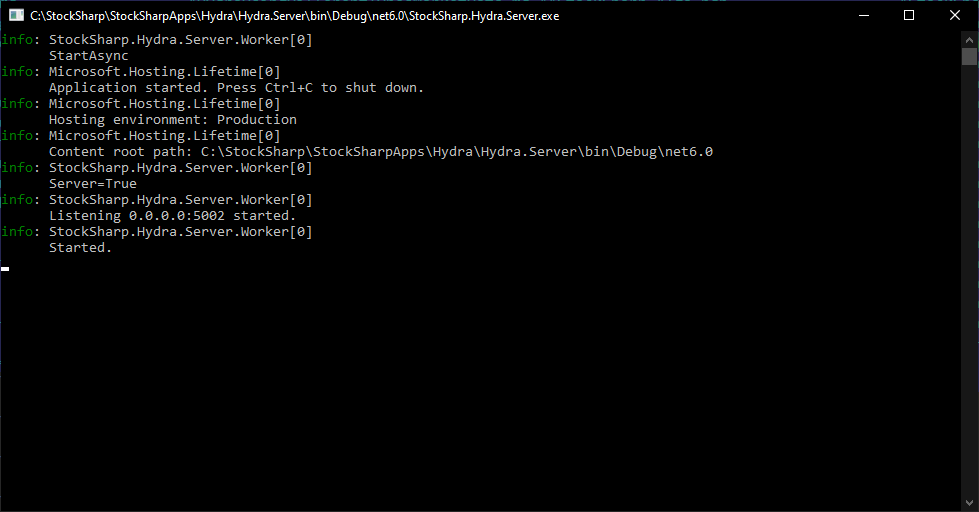

# Hydra сервер

**Hydra-сервер** - специальный сервис, который может транслировать данные по сети для подключения внешних программ (например, [Designer](designer.md)).

В отличие от [серверного режима](hydra/server_mode/settings.md), **Hydra-сервер** - это отдельная кросс платформенная программа, которая сделана ввиде консольного приложения, и может быть запущена на серверах Windows или Linux.

   > [!TIP]
   > Под Windows программа может быть зарегистрирована как Windows Service и запускаться при старте компьютера. Подробнее, о [сервисах](https://ru.wikipedia.org/wiki/%D0%A1%D0%BB%D1%83%D0%B6%D0%B1%D0%B0_Windows).

**Hydra-сервер** использует те же настройки, что и [Hydra](hydra.md). Поэтому для первичной настройки необходимо запустить программу [Hydra](hydra.md), и далее использовать созданные настройки программой **Hydra-сервер**.



Программа имеет конфигурационный файл appsettings.json:

```json
{
	"Logging": {
		"LogLevel": {
			"Default": "Information",
			"Microsoft.Hosting.Lifetime": "Information"
		}
	},
	"Server": {
		"WebApiAddress": "api.stocksharp.com/v1/",
		"LogLevel": "Inherit",
		"AutoDownload": false,
		"CompanyPath": "",
		"AppDataPath": ""
	}
}

```

- **WebApiAddress** - адрес WebAPI StockSharp. Используется для управления через [Telegram](telegram_services.md)
- **LogLevel** - уровень логирования.
- **AutoDownload** - включать ли автоматически скачивание источников при запуске.
- **CompanyPath** - в случае использовании программы как Windows Service необходимо задать путь вида "C:\\Users\\%user_name%\\Documents\\StockSharp"
- **AppDataPath** - в случае переноса директории с настройками [Hydra](hydra.md) необходимо задать новый путь к настройкам.
