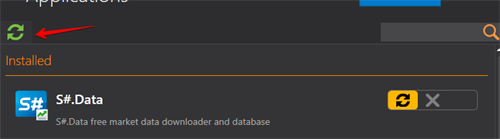

# Обновление программ

[Installer](../installer.md) самостоятельно отслеживает все обновления программ и обновляется сам автоматически. Поэтому нет необходимости удалять его после установки. 

Для проверки доступных обновлений в ручную, необходимо нажать на кнопку **Обновления** в правом углу в окне программы.

Если для программы доступны обновления, то [Installer](../installer.md) выдаст соответсвующее уведомление.

После чего нужно нажать на кнопку.

[Installer](../installer.md) не закрывается нажатием на **"Х"** в окне программы, а закрывается через панель инструментов.

Для этого переходим в меню, кликнув правой клавишей мыши, и нажимаем **Закрыть**.

**Смотреть [видеоинструкцию](videos/update_apps.md)**

## См. также

[Установка и удаление программ ](install_and_remove_apps.md)
