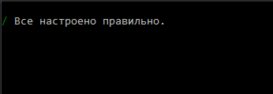

# Настройка подключения

**Runner** помимо [экспорта настроек через Дизайнер](export_from_designer.md) предоставляет возможность настроить программу через ее консольный интерфейс. Для этого необходимо запустить программу с командой **setup**:

```cmd
stocksharp.studio.runner setup
```

Появится меню:


Выбрав пункт Подключения, программа перейдет в режим настройки коннектора:


Здесь можно как отредактировать уже ранее сохраненное подключение, так и создать новое:


Выбрав нужный тип нового подключения, программа переместит в меню редактирования его настроек:


Для [Binance](../api/connectors/crypto_exchanges/binance.md) необходимо задать его основные настройки:


Для правильности введенных данных выберите **Проверить**:


Начнется проверка подключения:


В случае успеха будет показано сообщение:



После ввода всех настроек и их проверки необходимо нажать **Сохранить**:


В папке Data будет создан файл **connector.json** (если он не был создан ранее), который будет содержать сохраненные настройки.

Для настройки интеграции с [Telegram](../telegram_services.md) выберите пункт меню:


И авторизуйтесь по удобному способу:


Для авторизации по токену введите токен из [https://stocksharp.ru/profile/](https://stocksharp.ru/profile/):


В случае успеха программа выведет на экран доступные варианты работы с Телеграм:

