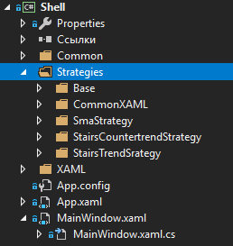
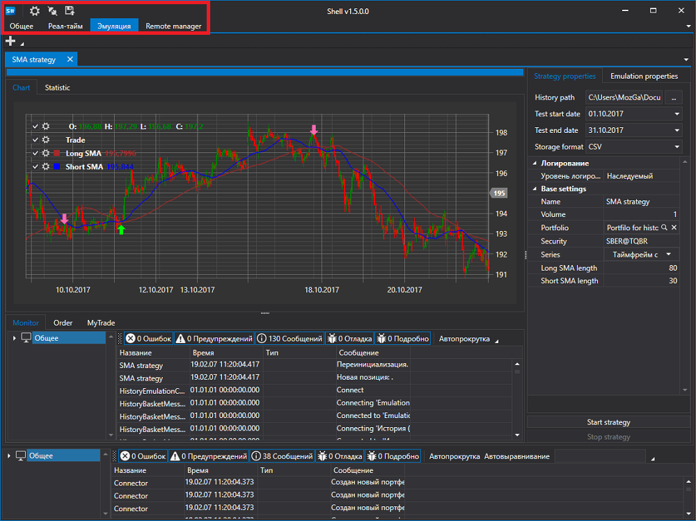
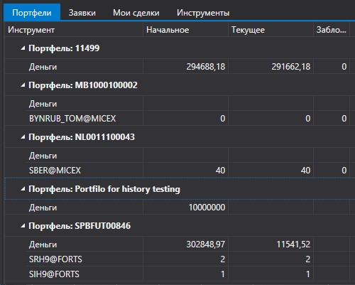
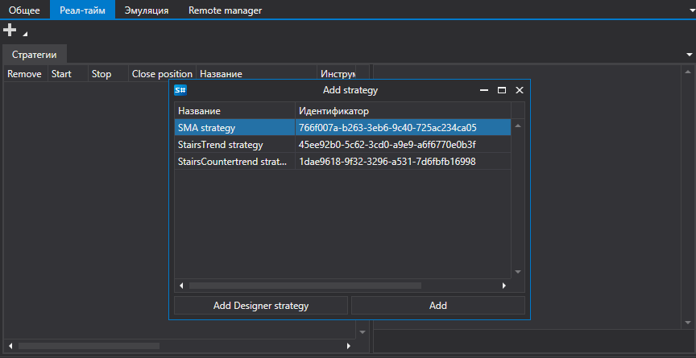
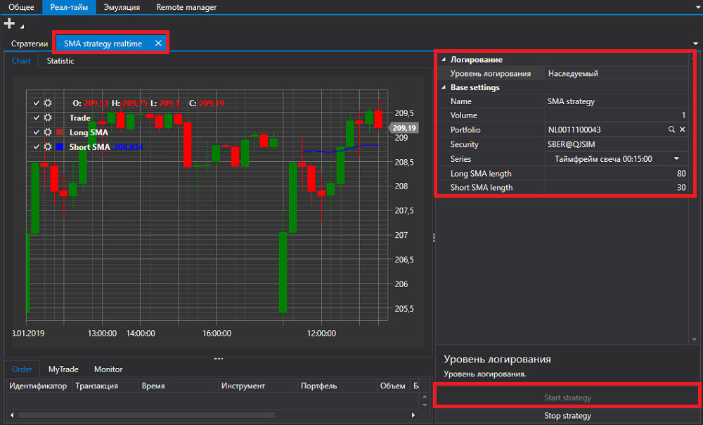
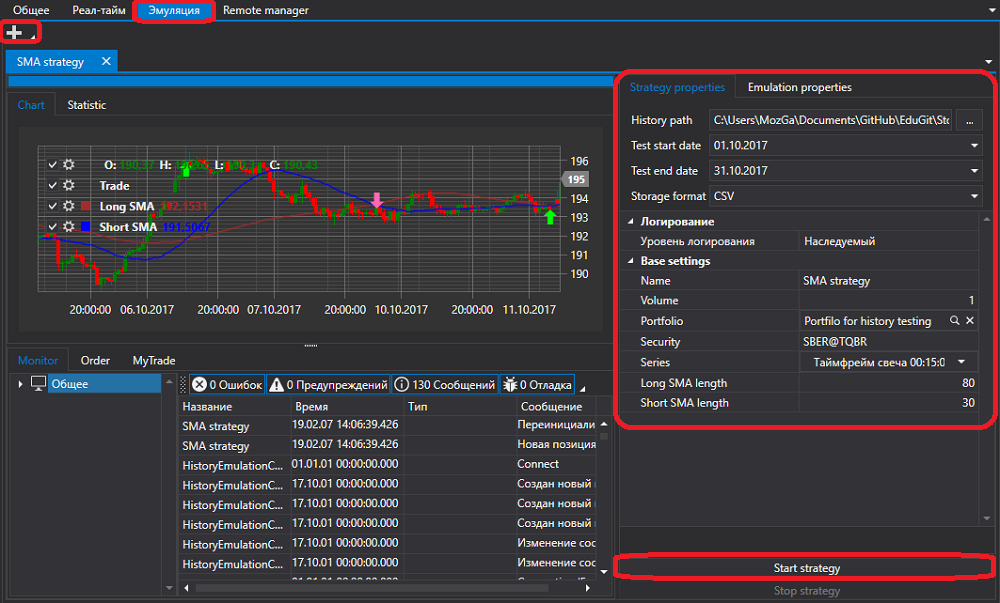

# Быстрый запуск

[Shell](../shell.md) \- ориентирована на программирование на языке [C\#](https://ru.wikipedia.org/wiki/C_Sharp) в среде Visual Studio или аналогичной.

При запуске проекта [Shell](../shell.md) в обозревателе решений будет отображен проект Shell:

Папка **Стратегии** содержит три стратегии, входящие в [Shell](../shell.md), оболочку для стратегий по умолчанию, а также некоторые вспомогательные интерфейсы.

Проект можно запускать без предварительной подготовки и посмотреть его работу на стратегиях, которые уже входят в [Shell](../shell.md).

После запуска мы увидим окно следующего вида:

В верхней части экрана расположены кнопки настройки подключения, подключения и кнопка сохранения текущей конфигурации Shell. Там же расположены основные вкладки.

Перейдем в настройки подключения и выберем необходимое подключение. Как настроить подключение описано в пункте [Настройки подключения](connections_settings.md).

Следующим шагом подключимся, нажав на кнопку **Подключиться** .

После подключения на вкладке [Общее](user_interface/common.md) можно посмотреть портфели, инструменты, заявки и собственные сделки, которые были получены из подключения.

Перейдя на вкладку Реал\-тайм, нажав на кнопку **Добавить**  добавим стратегию для запуска в торговлю.

После того как стратегия будет добавлена, необходимо заполнить ее основные параметры, такие как **Инструмент**, **Портфель** и др. Для запуска необходимо нажать на кнопку **Запустить стратегию**.

Аналогично вкладке [Реал\-тайм](user_interface/real_time.md) на вкладке [Эмуляция](user_interface/emulation.md) можно запустить тестирование стратегии на исторических данных.

