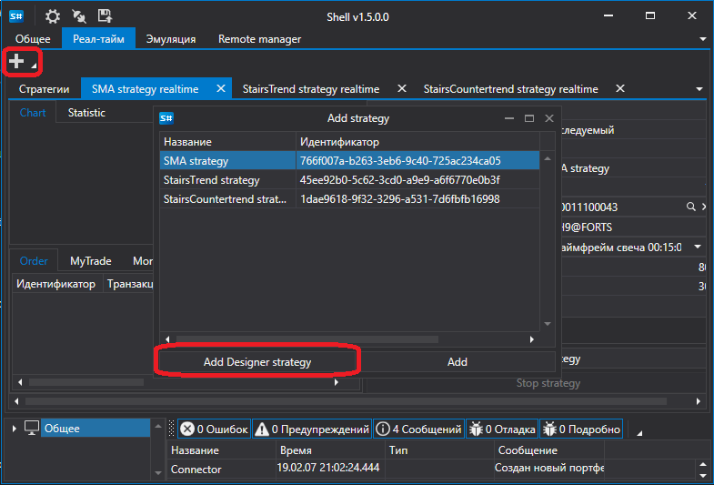
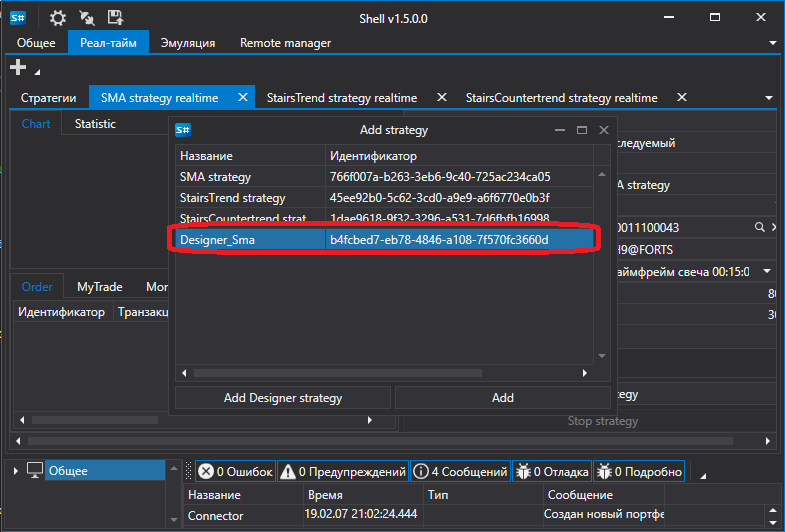
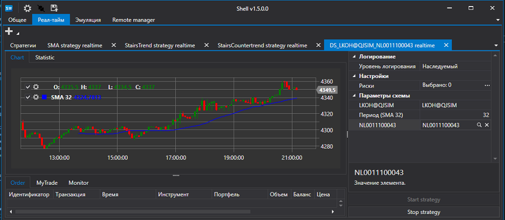

# Запуск стратегии, созданной в Designer

[Shell](../shell.md) может запускать стратегии, созданные в [Designer](../designer.md) и выгруженные через [Экспорт стратегий](../designer/export_import/export.md).

Для запуска стратегии, созданной в [Designer](../designer.md), необходимо выбрать ее на вкладке [Реал\-тайм](user_interface/real_time.md), нажать кнопку **Добавить стратегию Designer** и в появившемся окне выбрать файл стратегии, экспортированной из [Designer](../designer.md).

После чего она появится в списке доступных стратегий.

Выбрав добавленную стратегию, можно задать необходимые параметры и запустить ее в торговлю.

## См. также

[Создание собственной стратегии](create_strategy.md)
