# RemoteManager

Вкладка **RemoteManager** позволяет включать режим внешнего управления. Для включения этого режима необходимо зайти в меню настройки пользователей.

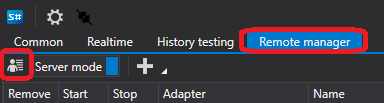

В появившемся окне задать **логин** и **пароль**.

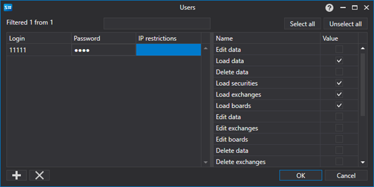

После чего необходимо включить **серверный режим**. 

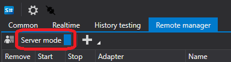

Теперь к Shell можно подключиться из другого Shell. 

Для этого необходимо запустить **другой** Shell. В нем перейти в настройки подключений.

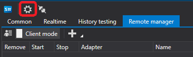

В открывшемся окне настроить FIX‐подключение.

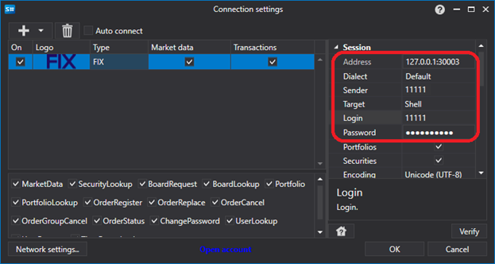

После чего нажать кнопку подключения.

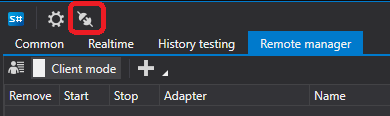

При подключении все имевшиеся стратегии в Shell‐сервере будут доступны в Shell‐клиенте.

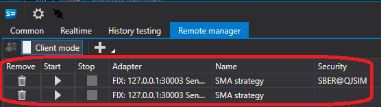

При нажатии на кнопку **Добавить** можно добавить еще одну стратегию в торговлю.

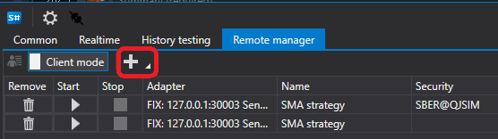

Так как Shell клиент поддерживает несколько серверов, при выборе добавления стратегии необходимо слева выбрать сервер, а справа будут все доступные стратегии на сервере.

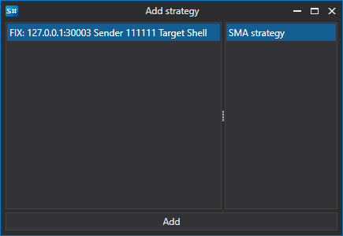

После добавления стратегии она появится в списке стратегий.

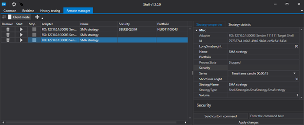

При выборе стратегии справа будут вкладки с настройками стратегии, а также с ее статистикой.

После изменения настроек стратегии обязательно нажать кнопку **Применить изменения**, иначе изменения не применятся к стратегии.

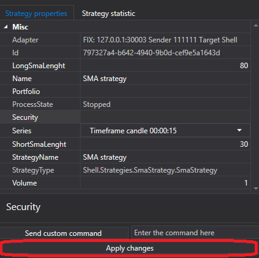

Если в стратегии есть команда отличная от Start/Stop, то для ее применения ее необходимо задать в следующем поле.

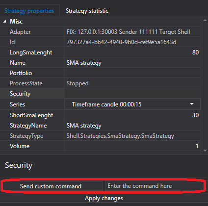

И нажать кнопку отправки команды.

Для задания своей команды в стратегии необходимо переопределить метод [Strategy.ApplyCommand](xref:StockSharp.Algo.Strategies.Strategy.ApplyCommand(StockSharp.Messages.CommandMessage))**(**[StockSharp.Messages.CommandMessage](xref:StockSharp.Messages.CommandMessage) cmdMsg **)**

```cs
public virtual void ApplyCommand(CommandMessage cmdMsg)
		
```

Базовый класс [Strategy](xref:StockSharp.Algo.Strategies.Strategy) только управляет запуском и остановкой стратегии.

## См. также

[Настройки подключения](../connections_settings.md)
