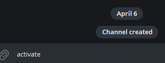
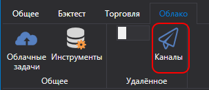
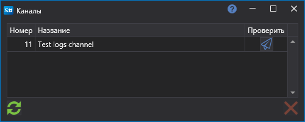

# Алерты

Сервис отправки из программ (например, [Designer](../designer.md) или собственная программа) сообщений в закрытые и публичные каналы или группы в месседжере Telegram.

Для настройки:

1. Пройдите процесс [авторизации у бота](authorization.md).

2. Создайте канал или группу (закрытую или открытую).

   
   

3. Добавьте бота [StockSharpBot](https://t.me/StockSharpBot)

   

4. Сделайте его администратором

   

5. Необходимые разрешения для корректной работы

   

6. Напишите в канал или группу специальное слово **activate**

   

7. В случае успеха вы получите ответ

   

Созданный канал доступен для ваших стратегий и торговых роботов:

- В случае использования [Designer](../designer.md) нажмите на список каналов в панели вверху:

  

  В появившемся окне вы увидите списки всех каналов и групп, где вы активировали бота:

  

  Нажав на кнопку с иконкой Телеграм, будет отправлено тестовое сообщение. Если вы его получите, это будет означать, что всё сделано верно.

  

  *В бесплатном тарифе добавляется строчка, упоминающая сайт StockSharp. В случае платных тарифов эта строчка убирается.*

  Если у вас несколько каналов вывода в Телеграм, и вы хотите разные стратегии выводить в разные каналы, вы можете указать конкретные каналы для каждой стратегии в свойствах:

  

- В других программах настройки сделаны аналогично [Designer](../designer.md). К примеру, в программе [Hydra](../hydra.md) вы можете настроить логирование ошибок закачки маркет-данных, если [Hydra](../hydra.md) расположена на сервере и вам необходимо оперативно получать информацию о нерабочем подключении.
- В случае [Shell](../shell.md) или [S\#](../api.md) вы можете посмотреть код, интегрирующий ваши стратегии с сервисом Телеграм.