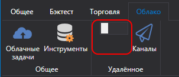
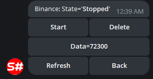

# Панель управления

Сервис управления торговыми стратегиями и роботами через Telegram-бота.

Для настройки предварительно пройдите процесс [авторизации у бота](authorization.md).

После этого бот готов к использованию. Далее, чтобы бот начал видеть ваши стратегии, вам необходимо:

- В случае использования программы [Designer](../designer.md) включите на панели Облако режим **Удаленное**:

  

  Все стратегии, которые запущены в режиме Live, автоматически будут переданы в Telegram-бот, и вы сможете управлять ими с телефона.
  
  В боте [StockSharpBot](https://t.me/StockSharpBot), выбрав команду /apps, можно увидеть список всех программ:

  

  Выбрав нужную программу, можно увидеть стратегии и элементы управления ими:

  

  

  

- В случае использования [Shell](../shell.md) вам необходимо перейти в панель **Удалённый менеджер** и сделать настройки, аналогичные тем, что в [Designer](../designer.md).
- В случае использования [Hydra](../hydra.md) все действия делаются аналогично [Designer](../designer.md). Интеграция с [Hydra](../hydra.md) позволяет управлять скачиванием маркет-данных и отслеживать количественную статистику.

  
  

- В случае использования [S\#](../api.md), вы можете сделать интеграцию, используя код из [Shell](../shell.md). Благодаря тому, что [S\#](../api.md) является кросс-платформенной, ваши роботы могут быть запущены на любой операционной системе.
