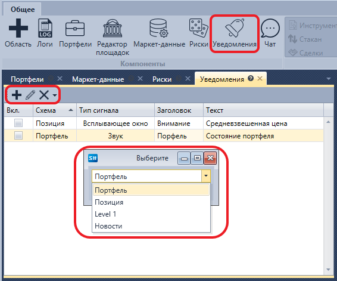

# Панель уведомлений

Панель **Уведомления** представляет собой таблицу, в которой отображается информация о всех заданных на текущий момент уведомлениях.

На панели **Уведомления** можно отредактировать существующее уведомление , удалить его  или задать новое уведомление .
