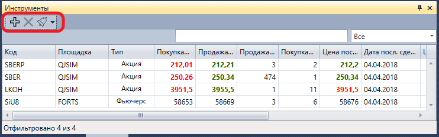

# Инструменты

Компонент **Инструменты** представляет собой таблицу с инструментами, в которой отображается информация о всех выбранных инструментах.

Для добавления нового инструмента необходимо нажать на кнопку .

Также имеется возможность настроить уведомления по событиям выбранных инструментов [Настройки уведомлений](../../notifications.md).

## См. также

[Level 1](level_1.md)
