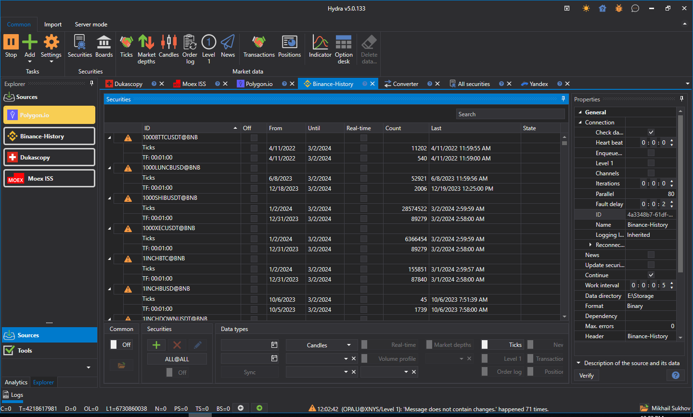

# 关于 StockSharp

[StockSharp (S#)](https://stocksharp.com/store/) 提供面向全球市场（美国、欧洲、亚洲、俄罗斯，涵盖股票、期货、期权、比特币、外汇等）的**免费**交易程序。用户可选择手动交易或通过自动化交易进行操作，包括算法交易机器人、传统交易或高频交易（HFT）。

**支持 90 多家券商、交易所和数据源：** [连接器](topics/api/connectors.md).

S# 与任何支持我们连接方式的经纪商均兼容。

> [!NOTE]
> **所有**程序的安装均通过 [Installer](topics/installer.md) 实用程序。

### 设计师

[Designer](topics/designer.md) 是一款通用的算法策略应用程序，可简化策略的创建：

- 通过鼠标点击创建交易策略的可视化设计器。
- 集成 [C#](https://en.wikipedia.org/wiki/C_Sharp_(programming_language)) 编辑。
- 轻松创建自定义指标。
- 内置调试器。
- 支持连接多个电子交易板和经纪商。
- 兼容全球所有交易平台。
- 可与团队共享数据模型。

[更多...](topics/designer.md)

### Hydra

[Hydra](topics/hydra.md) 是一款用于自动下载历史及实时市场数据的应用程序：

- 支持多种数据源 [连接器](topics/api/connectors.md).
- 压缩率极高（每笔交易 2 字节，每本订单簿 7 字节）。
- 支持处理任何数据类型（K线、Tick数据、订单簿、订单日志、期权、新闻等）。
- 对存储数据的 API 访问。
- 支持导出为 CSV、Excel、XML 或数据库格式。
- CSV 导入功能。
- 运行中的 Hydra 实例之间通过互联网进行定时任务和自动同步。

[更多...](topics/hydra.md)

### 终端

[Terminal](topics/terminal.md) 是一款交易和图表应用程序（交易终端）：

- 支持通过点击图表直接进行交易。
- 支持任意时间周期。
- 支持多种K线类型：成交量K线、Tick K线、波动范围K线、Renko K线。
- 包括簇状图和箱线图。

### Shell

Shell 提供了一个现成的图形化框架，可根据您的需求快速定制，并附带完整的 C# 开源代码：

- 包含完整的源代码。
- 支持所有 StockSharp 平台连接：FIX/FAST、加密货币交易所（目前超过 30 家）等。
- 支持 Designer 架构。
- 灵活的用户界面。
- 策略测试工具（统计、权益、报告）。
- 保存和加载策略设置。
- 策略的并发执行。
- 详细的策略表现分析（订单、交易、持仓、收益、日志等）。
- 策略的定时发布。

### API

[API](topics/api.md) 是一款用于在 C# 语言中专业开发交易机器人的库。它专为在 Visual Studio 中编程且从事算法交易的专业程序员而设计。

### 我们的产品：

- [Designer](topics/designer.md) - 通用算法策略设计工具。
- [Hydra](topics/hydra.md) - 市场数据下载程序。
- [API](topics/api.md) - 用于开发交易机器人的库 [C#](https://en.wikipedia.org/wiki/C_Sharp_(programming_language)).
- [Terminal](topics/terminal.md) - 交易终端。
- [Shell](topics/shell.md) - 带源代码的现成策略图形化框架。
- [MATLAB](topics/matlab.md) - MATLAB 与交易系统的集成。通过 MATLAB 脚本进行交易。

[下载](https://stocksharp.com/products/download/)

## 推荐内容

[参考资料](topics/common/reference_materials.md)
