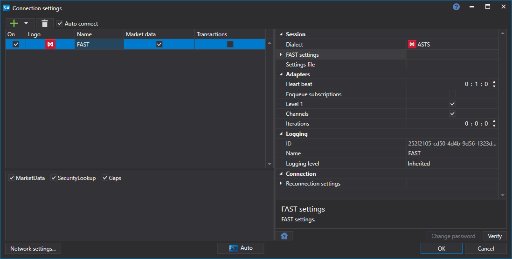

# 图形配置 快速

对于所有 [S\#](../../../../api.md) 产品，连接的图形配置在 [连接设置窗口](../../../graphical_user_interface/connection_settings_window.md) 上进行：

- **方言** - 方言 FAST 协议。必须作为第一个参数设置。选择后，下一个参数（**FAST 设置**）将包含指定的方言 IP 地址。
- **FAST 设置** - 方言（在上一个参数中选择）的 IP 地址和端口。您可以使用以下选项快速加载设置。
- **设置文件** - 快速选项，从交易所配置文件加载方言设置。
- **登录** - 登录（用于 TCP 恢复服务）。
- **密码** - 密码（用于 TCP 恢复服务）。

## 推荐内容

[连接器](../../../connectors.md)

[图形配置](../../graphical_configuration.md)

[创建自己的连接器](../../creating_own_connector.md)

[保存和加载设置](../../save_and_load_settings.md)
