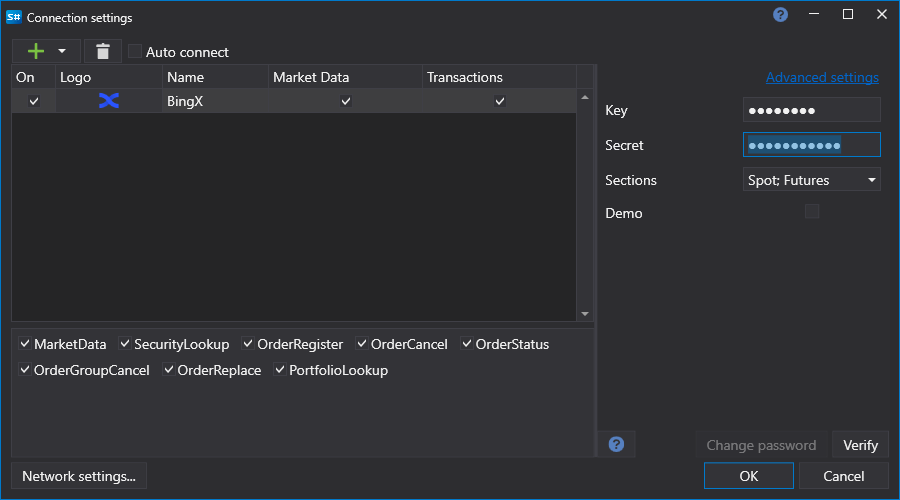

# BingX 图形化配置

对于所有 [S#](../../../../api.md) 产品，连接的图形化配置都在[连接设置窗口](../../../graphical_user_interface/connection_settings_window.md)中完成：

- **访问密钥** - API 密钥。
- **密钥** - API 私钥。
- **模拟模式** - 演示模式。
- **重新连接设置** - 与交易系统的重连机制参数。([重连设置](../../reconnection_settings.md))
