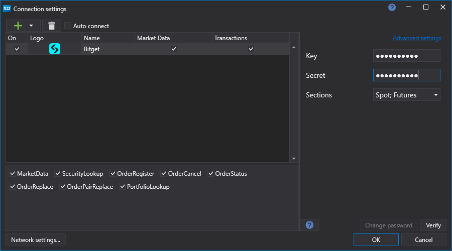

# Bitget 的图形配置

对于所有[S\#](../../../../api.md) 产品，连接的图形配置在[连接设置窗口](../../../graphical_user_interface/connection_settings_window.md)中进行：

- **关键** - 钥匙。
- **秘密** - 秘密。
- **部分** - 交易部分。
- **演示** - 连接到模拟交易。

## 另请参阅

[连接器](../../../connectors.md)

[图形配置](../../graphical_configuration.md)

[创建您自己的连接器](../../creating_own_connector.md)

[保存和加载设置](../../save_and_load_settings.md)
