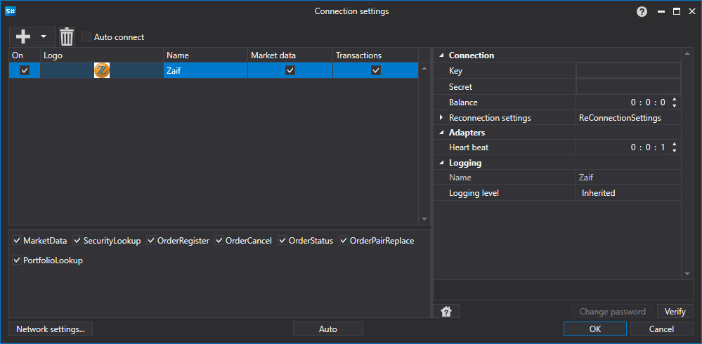

# 图形配置 Zaif

对于所有[S\#](../../../../api.md) 产品，连接的图形配置在[连接设置窗口](../../../graphical_user_interface/connection_settings_window.md) 上进行：

- **钥匙** - 钥匙。
- **秘密** \- 秘密。
- **余额** - 余额检查间隔。在存款和取款操作中需要。
- **心跳** - 服务器检查间隔，用于追踪连接是否仍然活着。默认值为 1 分钟。
- **重新连接设置** - 用于跟踪与交易系统设置连接的机制。([重新连接设置](../../reconnection_settings.md))

## 推荐内容

[连接器](../../../connectors.md)

[图形配置](../../graphical_configuration.md)

[创建自己的连接器](../../creating_own_connector.md)

[保存和加载设置](../../save_and_load_settings.md)
