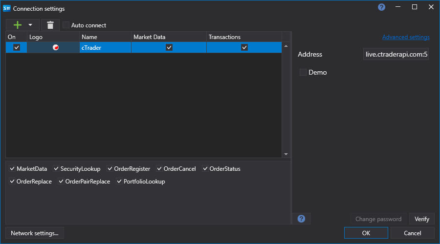
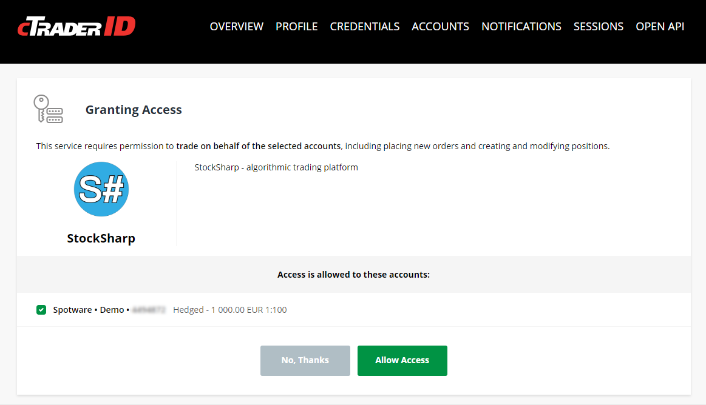

# cTrader 图形化配置

对于所有 StockSharp 产品，图形连接设置在 [连接设置窗口](../../../graphical_user_interface/connection_settings_window.md) 界面形式中进行：

- **演示** - 连接到模拟交易。

OAuth 授权：

cTrader 仅提供 OAuth 授权方式。

OAuth 授权流程：

1. 当你点击“检查”按钮时，会弹出一个窗口：

   

2. 点击“开始”后，用户将被重定向到 cTrader 网站进行登录。在 cTrader 网站上，您需要允许 StockSharp 应用访问交易操作：

   

3. 之后，您将被重定向回 StockSharp 网站，程序将自动登录。

## 另请参阅

[连接器](../../../connectors.md)

[OAuth](../../oauth.md)

[图形化配置](../../graphical_configuration.md)

[创建您自己的连接器](../../creating_own_connector.md)

[保存和加载设置](../../save_and_load_settings.md)