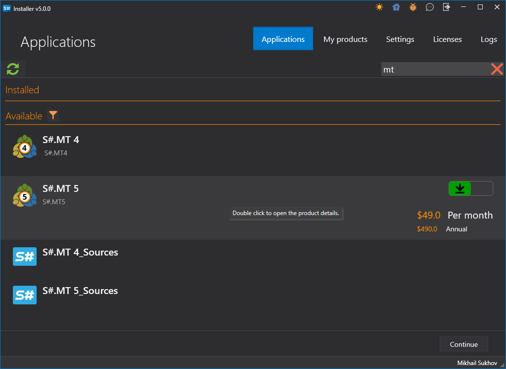
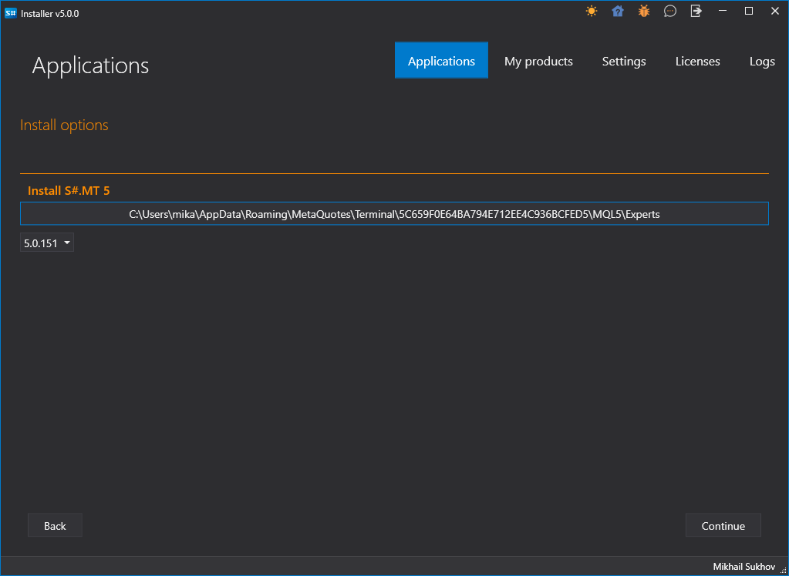
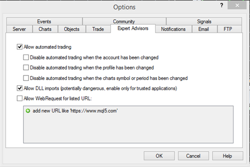
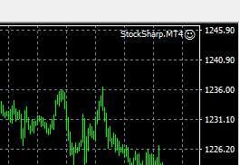
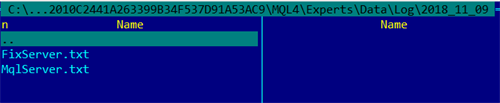

# MetaTrader

[StockSharp](../../../api.md) 通过专用连接器与 MT4 和 MT5 终端集成。要安装这些连接器，请使用 [Installer](../../../installer.md)（更多详情，请参见 [安装和卸载程序](../../../installer/install_and_remove_apps.md)）。

两个连接器的使用方法相同，因此下面是连接到 MT5 的操作说明：

## 设置 MT 连接器

> [!视频 https://www.youtube.com/embed/qGnIa7YIS5Q]

1. 在 [Installer](../../../installer.md) 中选择 MT 连接器并开始安装过程。

   

2. [安装程序](../../../installer.md) 会询问要将连接器安装到哪个文件夹（必须安装在 Experts 文件夹中）。

   

3. 如果安装了多个终端，您需要选择要安装连接器的终端。

   

4. 选择所需的终端后，将显示到专家文件夹的路径。

   

   > [!TIP]
   > - 如果路径无法自动确定，您需要通过目录搜索手动选择它 *C:\Users\%your_user_name%\AppData\Roaming\MetaQuotes\Terminal\%many_letters_and_numbers%\MQL4\Experts\*（对于MT5，路径将包含MQL5）。

5. 完成安装并等待安装结束。在安装结束时，[安装程序](../../../installer.md)会提示您现在需要配置终端。为此，请启动 MT 终端并连接到交易。
6. 在工具->选项菜单中，选择 **专家顾问** 标签，并确保已启用外部 DLL 交易的权限（**允许 DLL 导入**）：
7. 如果在安装连接器（步骤2）期间终端正在运行，您需要通过右键单击“专家”并从菜单中选择**刷新**来刷新专家列表：

   

8. 选择 S# 专家，右键点击并从菜单中选择 **附加到图表**：

   

9. 将会出现一个设置窗口，您可以在其中设置登录密码（默认启用匿名授权），以及连接地址（如果同时连接多个终端，地址必须包含唯一的端口）。
10. 图表的右上角应该出现一个笑脸图标（第一个遇到的）：

    

    Also, information about the successful script launch, the number of instruments, should appear in the expert's log window.
11. 如果未获取 MT4 或 MT5 许可证，日志中将出现类似以下的行：

    

12. 与 MT 的连接通过 FIX 协议进行，使用 [FIX 协议](../common/fix_protocol.md) 连接器。演示使用了程序 [Terminal](../../../terminal.md)。以下是交易连接和市场数据连接的设置（对于 MT5，默认端口是 23001 而不是 23000）：

    

    Similar settings need to be made in [Designer](../../../designer.md), [Hydra](../../../hydra.md), or any API programs.

    Login and password are left empty in case of anonymous authorization (previous item). If connecting to MT with multiple robots, a unique login must be provided for different connections identification.

    > [!TIP]
    > - The script must be launched before connecting StockSharp to MetaTrader and kept running as long as this connection is needed.  
    > - To see historical candles in StockSharp, they need to be downloaded from the MetaTrader server. How to do this, read in MetaTrader's documentation.

    In case of a successful connection, the example should show a list of instruments and accounts:

    

13. 如果发生错误，连接器日志将被保留，可在文件夹 **Experts\StockSharp\Data\Log** 中找到：

    