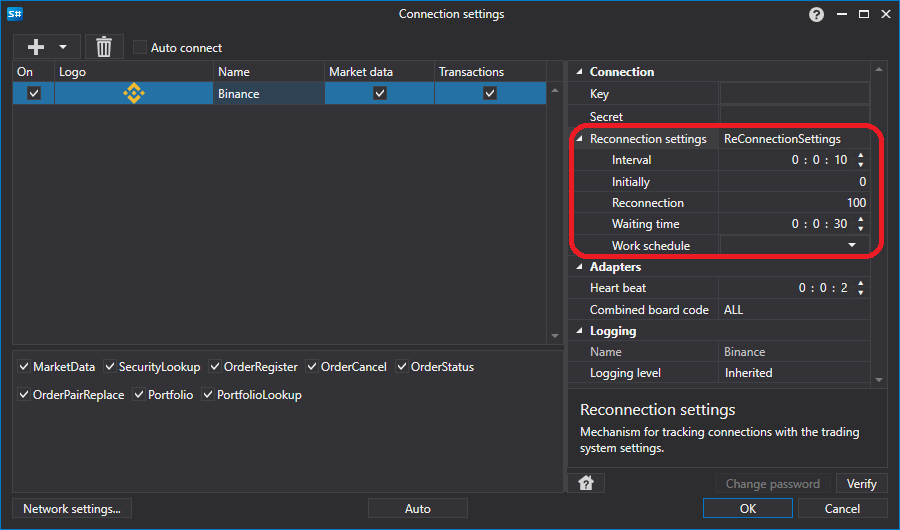
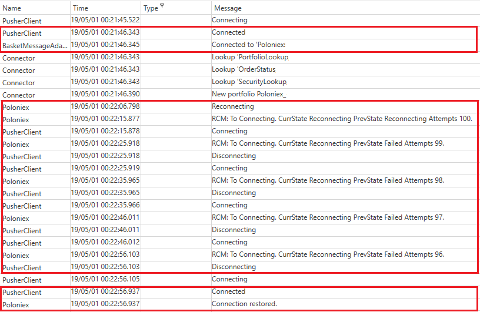

# 重连设置

所有连接器都提供在断开连接时配置重新连接的功能。在[连接设置窗口](../graphical_user_interface/connection_settings_window.md)图形元素中，它看起来像这样：



**重新连接属性**

- **间隔** - 连接尝试发生的间隔时间。
- **最初** - 如果初始连接未建立（超时、网络故障等），则尝试建立连接的次数。
- **重新连接** - 如果在操作过程中连接断开，重新连接的尝试次数。
- **超时** - 成功连接/断开连接的超时时间。
- **操作模式** - 在此模式下需要进行连接。

## 代码重新连接设置

重新连接机制通过 [ReConnectionSettings](xref:StockSharp.Messages.IMessageAdapter.ReConnectionSettings) 属性进行配置，并允许您监控以下错误场景：

- 无法建立连接（无通信、用户名/密码错误等）。[ReConnectionSettings.AttemptCount](xref:StockSharp.Messages.ReConnectionSettings.AttemptCount) 属性设置尝试建立连接的次数。默认值为 0，表示该模式被禁用。-1 表示无限次数尝试。
- 操作过程中连接被中断。[ReConnectionSettings.ReAttemptCount](xref:StockSharp.Messages.ReConnectionSettings.ReAttemptCount) 属性设置重新连接的尝试次数。默认值为 100。-1 表示无限次尝试。0 表示禁用模式。
- 在连接或断开连接时，可能长时间无法接收到相应的 [IConnector.Connected](xref:StockSharp.BusinessEntities.IConnector.Connected) 或 [IConnector.Disconnected](xref:StockSharp.BusinessEntities.IConnector.Disconnected) 事件。对于这种情况，可以使用 [ReConnectionSettings.TimeOutInterval](xref:StockSharp.Messages.ReConnectionSettings.TimeOutInterval) 属性来设置成功事件的最大可接受超时时间。如果在此时间之后，期望的事件仍未发生，则会触发 [IConnector.ConnectionError](xref:StockSharp.BusinessEntities.IConnector.ConnectionError) 事件，并显示超时错误。

1. 在创建网关时，您需要通过 [ReConnectionSettings](xref:StockSharp.Messages.IMessageAdapter.ReConnectionSettings) 属性初始化重连机制的设置：

   ```cs
   // 初始化重连机制（如果网关与服务器断开连接，
   // 它会每 10 秒自动连接一次）
   Connector.Adapter.ReConnectionSettings.Interval = TimeSpan.FromSeconds(10);
   // 重连仅在所选交易板的工作时间内运行
   // （用于在通常没有交易时禁用重连，例如夜间）
   Connector.Adapter.ReConnectionSettings.WorkingTime = ExchangeBoard.Nasdaq.WorkingTime;
   ```
2. 要检查连接控制机制的工作原理，可以关闭互联网连接：

   
3. 以下是程序日志，显示应用程序最初处于已连接状态，在关闭互联网连接后，应用程序尝试重新连接。在恢复互联网连接后，应用程序连接得以恢复：

   
4. 由于在 [Connector](xref:StockSharp.Algo.Connector) 中可以使用多个连接，默认情况下与重新连接相关的事件（如 [ConnectionRestored](xref:StockSharp.Algo.Connector.ConnectionRestored)）不会被触发，并且连接适配器会尝试自行重新连接。要开始触发该事件，您需要将适配器的 [BasketMessageAdapter.SuppressReconnectingErrors](xref:StockSharp.Algo.BasketMessageAdapter.SuppressReconnectingErrors) 属性值设置为 **false**。

   ```cs
   Connector.Adapter.SuppressReconnectingErrors = false;
   Connector.ConnectionError += error => this.Sync(() => MessageBox.Show(this, "连接已断开"));
   Connector.ConnectionRestored += adapter => this.Sync(() => MessageBox.Show(this, "连接已恢复"));
   ```

   
