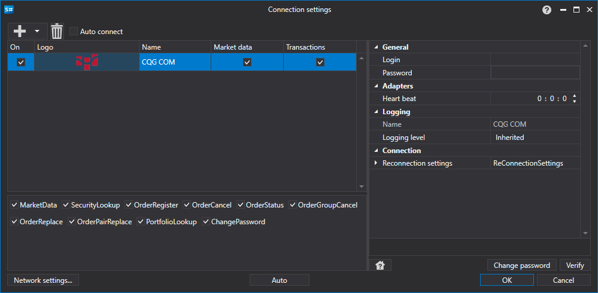

# CQG COM 图形化配置

对于所有 [S#](../../../../api.md) 产品，连接的图形化配置在 [连接设置窗口](../../../graphical_user_interface/connection_settings_window.md) 上进行：

- **登录** \- 登录。
- **密码** \- 密码。
- **心跳** - 用于服务器检查连接是否存活的间隔时间。默认值为1分钟。
- **重新连接设置** - 用于跟踪与交易系统设置连接的机制。([重新连接设置](../../reconnection_settings.md))

## 推荐内容

[连接器](../../../connectors.md)

[图形化配置](../../graphical_configuration.md)

[创建自己的连接器](../../creating_own_connector.md)

[保存和加载设置](../../save_and_load_settings.md)
