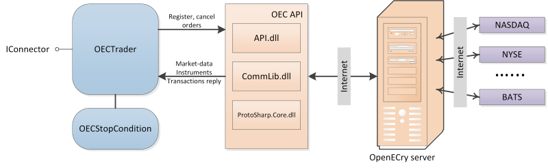

# OpenECry 配置

交互机制如图所示：

从图中可以看出，[OpenECryMessageAdapter](xref:StockSharp.OpenECry.OpenECryMessageAdapter) 通过 [GainFutures API](https://gainfutures.com/gainfuturesapi) 与 OEC 服务器通信。使用 [GainFutures API](https://gainfutures.com/gainfuturesapi) 不需要运行中的 OEC Trader 终端。

要使用连接器，必须指定 **Login** 和 **Password**。**Login** 和 **Password** 由经纪商提供。建议联系经纪商以获取 API 访问权限。
