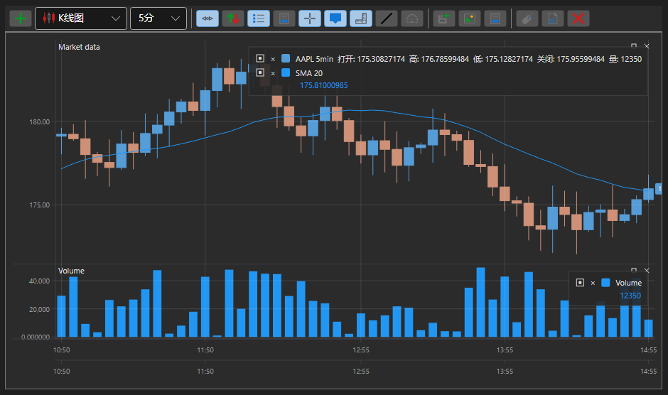

# 图表

[S#](../../api.md) 提供了便于绘制图表的组件。这些组件集合在命名空间 [StockSharp.Xaml.Charting](xref:StockSharp.Xaml.Charting) 中。

图形库的关键概念是 *chart* 的概念。*chart* 是用于构建图表的其他元素的容器。在 [S#](../../api.md) 中有几种类型的 *chart*：

- [图表](xref:StockSharp.Xaml.Charting.Chart) - 一个用于显示股票图表的图形组件。
- [ChartPanel](xref:StockSharp.Xaml.Charting.ChartPanel) - 一个用于显示股票图表的高级图形组件。
- [EquityCurveChart](xref:StockSharp.Xaml.Charting.EquityCurveChart) - 一个用于显示权益曲线的图形组件。
- [BoxChart](charts/box_chart.md) - 一种将数量表示为数字网格的图表。
- [ClusterChart](charts/cluster_chart.md) - 一种以集群和直方图显示数量的图表。
- [OptionPositionChart](xref:StockSharp.Xaml.Charting.OptionPositionChart) - 一个图形组件，显示相对于标的资产的期权持仓和“希腊字母”。参见 [OptionPositionChart](options/position_chart.md)。

此外，[S#](../../api.md) 包含两种用于成交量分析的图表类型：[BoxChart](charts/box_chart.md) 和 [ClusterChart](charts/cluster_chart.md)。

下图显示了图形组件的主要元素。

## 图形组件元素

## 图表

[IChart](xref:StockSharp.Charting.IChart) 是所有类型图表的基本接口。它包含用于添加和删除“子”元素的方法、自定义组件外观和绘制方法的属性，以及绘制图表本身的方法。一个*图表*可以包含多个用于绘图的区域 ([IChartArea](xref:StockSharp.Charting.IChartArea))（见图）。[Chart](xref:StockSharp.Xaml.Charting.Chart) 还包括一个*预览*区域（见图）。在该区域中，您可以使用滑块选择图表查看区域。此外，您可以通过拖动 [IChartArea](xref:StockSharp.Charting.IChartArea)、X 轴及鼠标滚轮来滚动和缩放图表。

**[IChart](xref:StockSharp.Charting.IChart) 的主要属性和方法**

- [IChart.Areas](xref:StockSharp.Charting.IChart.Areas) - [IChartArea](xref:StockSharp.Charting.IChartArea) 区域列表。
- [IThemeableChart.ChartTheme](xref:StockSharp.Charting.IThemeableChart.ChartTheme) - 组件的主题。
- [IChart.IndicatorTypes](xref:StockSharp.Charting.IChart.IndicatorTypes) - 可以在图表上显示的指标列表。
- [IChart.CrossHair](xref:StockSharp.Charting.IChart.CrossHair) - 启用/禁用十字线显示。
- [IChart.CrossHairAxisLabels](xref:StockSharp.Charting.IChart.CrossHairAxisLabels) - 启用/禁用在十字线处显示坐标轴标签。
- [IChart.IsAutoRange](xref:StockSharp.Charting.IChart.IsAutoRange) - 启用/禁用自动 X 轴缩放。
- [IChart.IsAutoScroll](xref:StockSharp.Charting.IChart.IsAutoScroll) - 在X轴上启用/禁用自动滚动。
- [IChart.ShowLegend](xref:StockSharp.Charting.IChart.ShowLegend) - 启用/禁用图例的显示。
- [IChart.ShowOverview](xref:StockSharp.Charting.IChart.ShowOverview) - 启用/禁用*概览*预览区域的显示。
- [IChart.AddArea](xref:StockSharp.Charting.IChart.AddArea(StockSharp.Charting.IChartArea)) - 添加一个 [IChartArea](xref:StockSharp.Charting.IChartArea)。
- [IChart.AddElement](xref:StockSharp.Charting.IChart.AddElement(StockSharp.Charting.IChartArea, StockSharp.Charting.IChartElement)) - 添加一个数据序列元素。具有多个重载。
- [IChart.Reset](xref:StockSharp.Charting.IChart.Reset(System.Collections.Generic.IEnumerable{StockSharp.Charting.IChartElement})) - “重置”先前绘制的值。
- [IChart.Draw](xref:StockSharp.Charting.IThemeableChart.Draw(StockSharp.Charting.IChartDrawData)) - 在图表上绘制一个数值。
- [IChart.OrderCreationMode](xref:StockSharp.Charting.IChart.OrderCreationMode) - 订单创建模式，启用后允许从图表创建订单。默认关闭。

## 图表区域

[IChartArea](xref:StockSharp.Charting.IChartArea) - 一个绘制图表的区域，作为 [IChartElement](xref:StockSharp.Charting.IChartElement)（指标、K线等）在图表上渲染的容器，以及图表坐标轴 ([IChartAxis](xref:StockSharp.Charting.IChartAxis))。

**[IChartArea](xref:StockSharp.Charting.IChartArea) 的关键属性**

- [IChartArea.Elements](xref:StockSharp.Charting.IChartArea.Elements) - [IChartElement](xref:StockSharp.Charting.IChartElement) 列表。
- [IChartArea.XAxises](xref:StockSharp.Charting.IChartArea.XAxises) - 水平轴列表。
- [IChartArea.YAxises](xref:StockSharp.Charting.IChartArea.YAxises) - 垂直轴列表。

## 图表元素

图表上显示的所有元素都必须实现 [IChartElement](xref:StockSharp.Charting.IChartElement) 接口。在 [S#](../../api.md) 中，以下类实现了该接口：

- [ChartCandleElement](xref:StockSharp.Xaml.Charting.ChartCandleElement) - 用于显示K线的元素。
- [ChartIndicatorElement](xref:StockSharp.Xaml.Charting.ChartIndicatorElement) - 一个用于显示指示器的元素。
- [ChartOrderElement](xref:StockSharp.Xaml.Charting.ChartOrderElement) - 一个用于显示订单的元素。
- [ChartTradeElement](xref:StockSharp.Xaml.Charting.ChartTradeElement) - 一个用于显示交易的元素。

视觉元素的类具有多个用于调整图表外观的属性。您可以调整元素的颜色、线条粗细和样式。例如，使用属性 [IChartCandleElement.DrawStyle](xref:StockSharp.Charting.IChartCandleElement.DrawStyle)，您可以更改K线的外观（K线或条形）。使用属性 [ChartIndicatorElement.DrawStyle](xref:StockSharp.Xaml.Charting.ChartIndicatorElement.DrawStyle)，您可以设置指标线的样式。要将指标显示为柱状图，请使用值 [DrawStyles.Histogram](xref:Ecng.Drawing.DrawStyles.Histogram)。属性 [ChartCandleElement.ShowAxisMarker](xref:StockSharp.Xaml.Charting.ChartCandleElement.ShowAxisMarker) 和 [ChartIndicatorElement.ShowAxisMarker](xref:StockSharp.Xaml.Charting.ChartIndicatorElement.ShowAxisMarker) 允许开/关图表坐标轴上的标记显示（见图）。

## 另请参阅

- [K线](charts/candle_chart.md)
- [图表面板](charts/candle_chart_panel.md)
- [权益曲线图](charts/equity_curve_chart.md)
- [箱形图](charts/box_chart.md)
- [集群](charts/cluster_chart.md)