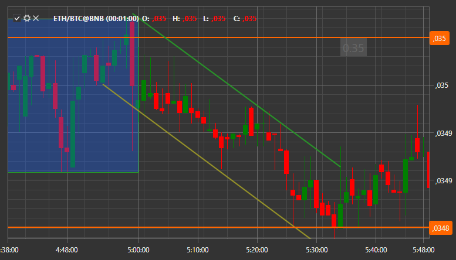

# 注释

[S#](../../../api.md) 提供了以文本、线条等形式向图表添加注释的功能。



添加注释与向图表添加其他信息的方式相同。首先你需要创建 [ChartAnnotation](xref:StockSharp.Xaml.Charting.ChartAnnotation) 并将其添加到图表区域：

```cs
var _annotation = new ChartAnnotation { Type = ChartAnnotationTypes.BoxAnnotation };
Chart.AddElement(chartArea, _annotation);
		
```

之后，您需要初始化一个新的 [AnnotationData](xref:StockSharp.Xaml.Charting.ChartDrawData.AnnotationData) 类实例，在其中描述注释，并将其传递给 [IChart.Draw](xref:StockSharp.Charting.IThemeableChart.Draw(StockSharp.Charting.IChartDrawData)**(**[StockSharp.Charting.IChartDrawData](xref:StockSharp.Charting.IChartDrawData) 数据 **)** 方法以在图表上绘制:

```cs
var data = new ChartDrawData.AnnotationData
{
	X1 = new DateTimeOffset(2017, 10, 02, 8, 30, 0, TimeSpan.FromHours(1)),
	X2 = new DateTimeOffset(2017, 10, 02, 10, 30, 0, TimeSpan.FromHours(1)),
	Y1 = 193.5m,
	Y2 = 194m,
	IsVisible = true,
	Stroke = new SolidColorBrush(Color.FromRgb(0, 0, 255)),
	Thickness = new Thickness(3),
	Text = "New annotation",
	HorizontalAlignment = HorizontalAlignment.Stretch,
	VerticalAlignment = VerticalAlignment.Stretch,
	LabelPlacement = LabelPlacement.Axis,
	ShowLabel = true,
	CoordinateMode = AnnotationCoordinateMode.Absolute,
};
var drawData = new ChartDrawData();
drawData.Add(_annotation, data);
Chart.Draw(drawData);
		
```
