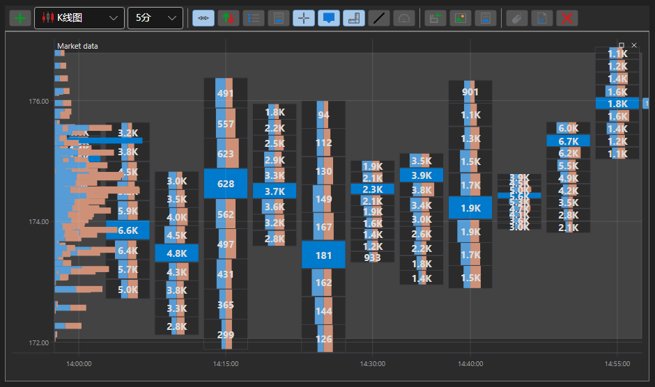

# 箱形图

BoxChart - 是一种用于以数字网格形式显示交易量的特殊图表类型。要使用这种图表类型，需要设置特殊样式 [ChartCandleElement.DrawStyle](xref:StockSharp.Xaml.Charting.ChartCandleElement.DrawStyle) = [ChartCandleDrawStyles.BoxVolume](xref:StockSharp.Charting.ChartCandleDrawStyles.BoxVolume)。此图表使用 [PriceLevels](xref:StockSharp.Messages.CandleMessage.PriceLevels) 属性中的信息作为源数据。

**主要属性**

- [ChartCandleElement.Timeframe2Multiplier](xref:StockSharp.Xaml.Charting.ChartCandleElement.Timeframe2Multiplier) — 应用于构造函数中指定的主时间框架的乘数因子，以获取第二个时间框架。显示的K线以对应第二时间框架大小的分组方式组合在一起。这些分组由各自颜色的网格和框架绘制在图表上。
- [ChartCandleElement.Timeframe3Multiplier](xref:StockSharp.Xaml.Charting.ChartCandleElement.Timeframe3Multiplier) — 类似于 [ChartCandleElement.Timeframe2Multiplier](xref:StockSharp.Xaml.Charting.ChartCandleElement.Timeframe2Multiplier)，但适用于第三个时间框架。第三个时间框架在图表上使用对应颜色的网格绘制。
- [ChartCandleElement.FontColor](xref:StockSharp.Xaml.Charting.ChartCandleElement.FontColor) - 图表上的成交量数值颜色。
- [ChartCandleElement.MaxVolumeColor](xref:StockSharp.Xaml.Charting.ChartCandleElement.MaxVolumeColor) - 图表上指定K线的最大成交量的成交量数值颜色。
- [ChartCandleElement.Timeframe2Color](xref:StockSharp.Xaml.Charting.ChartCandleElement.Timeframe2Color) - 第二时间框架网格颜色。
- [ChartCandleElement.Timeframe2FrameColor](xref:StockSharp.Xaml.Charting.ChartCandleElement.Timeframe2FrameColor) - 第二时间框架的框架颜色。
- [ChartCandleElement.Timeframe3Color](xref:StockSharp.Xaml.Charting.ChartCandleElement.Timeframe3Color) - 第三时间框架网格颜色。

使用这种类型图表的一个例子是在 *Samples/Common/SampleChart*。

> [!TIP]
> 要在图表类型之间切换，请使用位于图表左上角的设置按钮（齿轮）。
