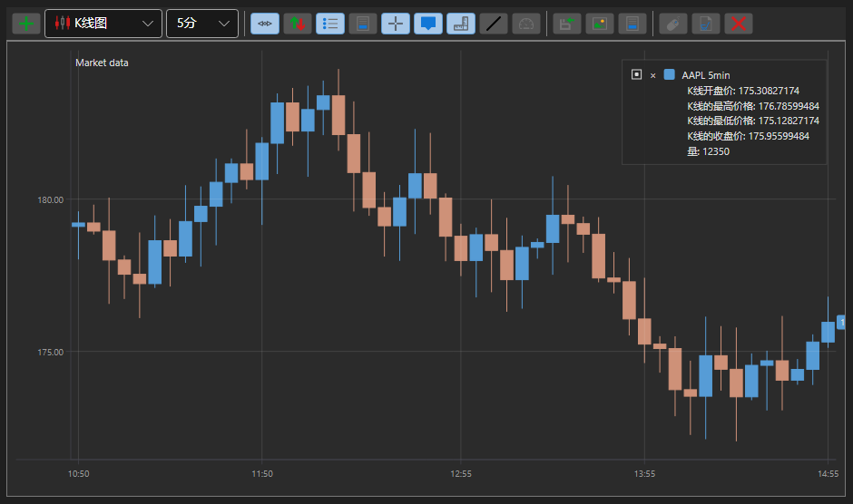

# K线

[Chart](xref:StockSharp.Xaml.Charting.Chart) 是一个图形组件，允许构建股票图表：K线、指标，并在图表上显示订单和交易标记。

下面是使用 [Chart](xref:StockSharp.Xaml.Charting.Chart) 组件构建图表的示例。该示例基于 Samples/02_Candles/01_Realtime，并进行了一些修改。



## 使用 Chart 构建图表的示例

1. 在 XAML 中，我们创建一个窗口并将 [Chart](xref:StockSharp.Xaml.Charting.Chart) 图形组件添加到其中。我们将组件命名为 **Chart**。注意，在创建窗口时，需要添加命名空间 *http:\/\/schemas.stocksharp.com\/xaml*。

   ```xaml
   <Window x:Class="SampleCandles.ChartWindow"
           xmlns="http://schemas.microsoft.com/winfx/2006/xaml/presentation"
           xmlns:x="http://schemas.microsoft.com/winfx/2006/xaml"
           xmlns:charting="http://schemas.stocksharp.com/xaml"
           Title="ChartWindow" Height="300" Width="300">
      <charting:Chart x:Name="Chart" x:FieldModifier="public" />
   </Window>
   ```

2. 在主窗口代码中，我们声明图表区域、图表元素、指标和订阅的变量。

   ```cs
   private readonly Dictionary<Subscription, ChartWindow> _chartWindows = new Dictionary<Subscription, ChartWindow>();
   private readonly Connector _connector = new Connector();
   private readonly LogManager _logManager;
   private ChartArea _candlesArea;
   private ChartArea _indicatorsArea;
   private ChartIndicatorElement _smaChartElement;
   private ChartIndicatorElement _macdChartElement;
   private ChartCandleElement _candlesElem;
   private SimpleMovingAverage _sma;
   private MovingAverageConvergenceDivergence _macd;
   ```

3. 在 **Connect** 按钮的 **Click** 事件处理程序中，除了订阅连接器事件并调用 [IConnector.Connect](xref:StockSharp.BusinessEntities.IConnector.Connect) 方法之外，我们还订阅了 [Connector.CandleReceived](xref:StockSharp.Algo.Connector.CandleReceived) 事件。在该事件处理程序中，当收到新的K线时，将绘制图表。

   ```cs
   private void ConnectClick(object sender, RoutedEventArgs e)
   {
       _connector.CandleReceived += OnCandleReceived;
       
       // 订阅其他必要事件
       _connector.Connected += () => this.GuiAsync(() => { /* 处理连接 */ });
       _connector.Disconnected += () => this.GuiAsync(() => { /* 处理断开连接 */ });
       
       // 连接到交易系统
       _connector.Connect();
   }
   ```

4. 在 **ShowChart** 按钮处理程序中，我们创建指标对象、区域和图表元素。我们将元素添加到区域，将区域添加到图表。我们打开图表窗口并开始订阅K线。

   ```cs
   private void ShowChartClick(object sender, RoutedEventArgs e)
   {
       var security = SelectedSecurity;
       
       // 创建 K线订阅
       var subscription = new Subscription(
           DataType.TimeFrame(TimeSpan.FromMinutes(5)),
           security)
       {
           MarketData = 
           {
               // 请求 30 天的历史数据
               From = DateTime.Today.Subtract(TimeSpan.FromDays(30)),
               To = DateTime.Now,
               // 仅获取已完成的 K线
               IsFinishedOnly = true
           }
       };
       
       // 创建图表窗口
       _chartWindows.SafeAdd(subscription, key =>
       {
           var wnd = new ChartWindow
           {
               Title = $"{security.Code} {TimeSpan.FromMinutes(5)}"
           };
           wnd.MakeHideable();
           
           // 初始化指标
           _sma = new SimpleMovingAverage() { Length = 11 };
           _macd = new MovingAverageConvergenceDivergence();
           
           // 初始化图表元素
           _smaChartElement = new ChartIndicatorElement();
           _macdChartElement = new ChartIndicatorElement();
           _candlesElem = new ChartCandleElement();
           
           // 将 MACD 显示样式设置为直方图
           _macdChartElement.DrawStyle = DrawStyles.Histogram;
           
           // 初始化图表区域
           _candlesArea = new ChartArea();
           _indicatorsArea = new ChartArea();
           
           // 向图表添加区域
           wnd.Chart.Areas.Add(_candlesArea);
           wnd.Chart.Areas.Add(_indicatorsArea);
           
           // 向区域添加元素
           _candlesArea.Elements.Add(_candlesElem);
           _candlesArea.Elements.Add(_smaChartElement);
           _indicatorsArea.Elements.Add(_macdChartElement);
           
           // 将图表元素绑定到订阅以自动绘制
           wnd.Chart.AddElement(_candlesArea, _candlesElem, subscription);
           wnd.Chart.AddElement(_candlesArea, _smaChartElement, subscription);
           wnd.Chart.AddElement(_indicatorsArea, _macdChartElement, subscription);
           
           return wnd;
       }).Show();
       
       // 启动 K线订阅
       _connector.Subscribe(subscription);
   }
   ```

5. 在 [Connector.CandleReceived](xref:StockSharp.Algo.Connector.CandleReceived) 事件处理程序中，我们绘制每根完成K线的K线和指标值。

   ```cs
   private void OnCandleReceived(Subscription subscription, ICandleMessage candle)
   {
       var wnd = _chartWindows.TryGetValue(subscription);
       if (wnd == null)
           return;
       
       // 只处理已完成的 K线
       if (candle.State != CandleStates.Finished)
           return;
       
       // 计算指标值
       var smaValue = _sma.Process(candle);
       var macdValue = _macd.Process(candle);
       
       // 创建绘制数据
       var data = new ChartDrawData();
       data
           .Group(candle.OpenTime)
               .Add(_candlesElem, candle)
               .Add(_smaChartElement, smaValue)
               .Add(_macdChartElement, macdValue);
       
       // 在用户界面线程中将数据绘制到图表
       this.GuiAsync(() => wnd.Chart.Draw(data));
   }
   ```

## 带自动绘图的示例

从最新版本的 StockSharp 开始，可以设置自动绘制图表，而无需显式调用 Draw 方法。为此，在配置 Chart 时，使用 AddElement 方法，它将图表元素与订阅关联起来：

```cs
private void SetupAutoDrawingChart()
{
	var security = SelectedSecurity;
	
	// 创建图表元素
	var candleElement = new ChartCandleElement();
	var smaElement = new ChartIndicatorElement { Title = "SMA" };
	
	// 创建图表区域
	var area = new ChartArea();
	
	// 向图表添加区域
	Chart.Areas.Add(area);
	
	// 创建 K线订阅
	var subscription = new Subscription(
		DataType.TimeFrame(TimeSpan.FromMinutes(5)),
		security)
	{
		MarketData = 
		{
			From = DateTime.Today.Subtract(TimeSpan.FromDays(30)),
			To = DateTime.Now
		}
	};
	
	// 将元素绑定到图表区域和订阅
	Chart.AddElement(area, candleElement, subscription);
	Chart.AddElement(area, smaElement, subscription);
	
	// 创建指标
	var sma = new SimpleMovingAverage { Length = 14 };
	
	// 订阅 K线接收事件以处理指标
	_connector.CandleReceived += (sub, candle) => 
	{
		if (sub == subscription && candle.State == CandleStates.Finished)
		{
			// 用指标处理 K线并获取值
			var smaValue = sma.Process(candle);
			
			// 绘制指标值
			var data = new ChartDrawData();
			data
				.Group(candle.OpenTime)
					.Add(smaElement, smaValue);
			
			this.GuiAsync(() => Chart.Draw(data));
		}
	};
	
	// 启动订阅
	_connector.Subscribe(subscription);
}
```

## 在图表上显示订单和交易

您可以直接在图表上显示订单和交易标记：

```cs
// 创建用于显示订单和成交的元素
var orderElement = new ChartOrderElement();
var tradeElement = new ChartTradeElement();

// 向图表区域添加元素
_candlesArea.Elements.Add(orderElement);
_candlesArea.Elements.Add(tradeElement);

// 订阅订单和成交接收事件
_connector.OrderReceived += (sub, order) => 
{
	if (order.Security != _security)
		return;
	
	// 在图表上绘制订单
	var data = new ChartDrawData();
	data.Group(order.Time).Add(orderElement, order);
	
	this.GuiAsync(() => Chart.Draw(data));
};

_connector.OwnTradeReceived += (sub, trade) => 
{
	if (trade.Order.Security != _security)
		return;
	
	// 在图表上绘制成交
	var data = new ChartDrawData();
	data.Group(trade.Time).Add(tradeElement, trade);
	
	this.GuiAsync(() => Chart.Draw(data));
};
```

## 清除图表

要清除图表，您可以使用 Reset 方法：

```cs
// 清除整个图表
Chart.Reset();

// 清除指定区域
_candlesArea.Reset();

// 清除指定元素
_candlesElem.Reset();
```
