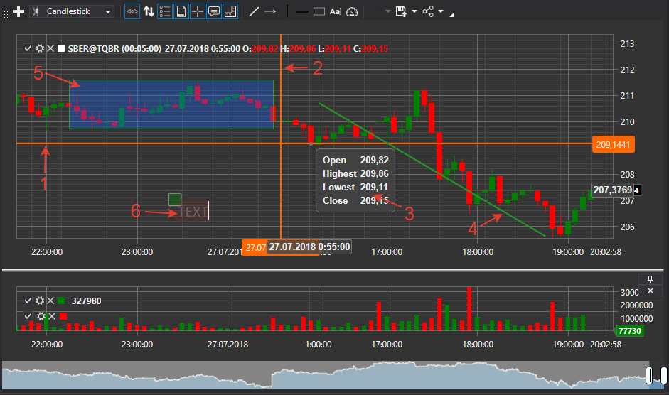

# K线图面板

[ChartPanel](xref:StockSharp.Xaml.Charting.ChartPanel) 是用于创建股票图表的高级组件，具有工具栏和附加功能。使用 [ChartPanel](xref:StockSharp.Xaml.Charting.ChartPanel) 绘图的技术与 [Chart](candle_chart.md) 并没有显著差异。

下图显示了组件的外观以及工具栏按钮的功能。

1 - 横线；

2 - 竖线；

3 - 提示；

4 - 趋势线；

5 - 区域；

6 - 这是文本。

**工具栏功能**

1 - 添加面板；

2 - 启用自动滚动；

3 - 启用自动缩放；

4 - 启用图例；

5 - 启用预览区；

6 - 启用十字线；

7 - 启用柱提示；

8 - 在轴上显示数值；

9 - 绘制趋势线；

10 - 绘制指针；

11 - 绘制垂直线；

12 - 绘制水平线；

13 - 选择区域；

14 - 文本标签；

15 - 显示FPS统计；

16 - 订单注册；

17 - 保存数据；

18 - 发布；
