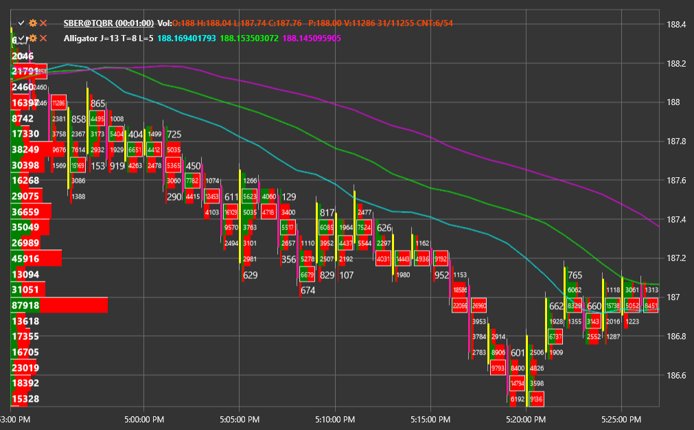

# 簇状图

ClusterChart - 是一种特殊类型的图表，用于以柱状图的形式显示集群中的成交量。要使用这种类型的图表，需要设置特殊样式 [IChartCandleElement.DrawStyle](xref:StockSharp.Charting.IChartCandleElement.DrawStyle) = [ChartCandleDrawStyles.ClusterProfile](xref:StockSharp.Charting.ChartCandleDrawStyles.ClusterProfile)。此图表使用 [PriceLevels](xref:StockSharp.Messages.CandleMessage.PriceLevels) 属性中的信息作为源数据。

**主要属性**

- [ChartCandleElement.ClusterLineColor](xref:StockSharp.Xaml.Charting.ChartCandleElement.ClusterLineColor) - 基本群集线颜色。
- [ChartCandleElement.ClusterTextColor](xref:StockSharp.Xaml.Charting.ChartCandleElement.ClusterTextColor) - 图表上的成交量数值颜色。
- [ChartCandleElement.ClusterColor](xref:StockSharp.Xaml.Charting.ChartCandleElement.ClusterColor) - 聚类直方图中主要条形的颜色。
- [ChartCandleElement.ClusterMaxColor](xref:StockSharp.Xaml.Charting.ChartCandleElement.ClusterMaxColor) - 集群直方图中最大音量条的颜色。

使用这种类型图表的一个例子是在 *Samples/Common/SampleChart*。

> [!TIP]
> 要在图表类型之间切换，请使用位于图表左上角的设置按钮（齿轮）。
