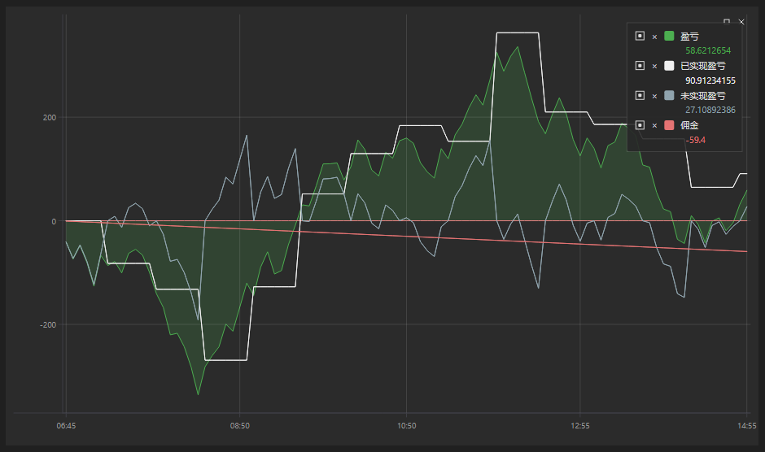

# 净值曲线图

[EquityCurveChart](xref:StockSharp.Xaml.Charting.EquityCurveChart) - 用于显示权益曲线的图形组件。

下面是使用该组件的示例。完整示例代码在 Samples/Testing/SampleHistoryTesting 中。



## 股权曲线图绘制示例

1. 我们将 [EquityCurveChart](xref:StockSharp.Xaml.Charting.EquityCurveChart) 图形组件添加到 XAML。将 **Curve** 名称分配给该组件。

   ```xaml
   <Window x:Class="SampleRandomEmulation.MainWindow"
           xmlns="http://schemas.microsoft.com/winfx/2006/xaml/presentation"
           xmlns:x="http://schemas.microsoft.com/winfx/2006/xaml"
           xmlns:loc="clr-namespace:StockSharp.Localization;assembly=StockSharp.Localization"
           Title="{x:Static loc:LocalizedStrings.XamlStr564}" Height="460" Width="604"
   		xmlns:sx="clr-namespace:StockSharp.Xaml;assembly=StockSharp.Xaml"
   		xmlns:charting="http://schemas.stocksharp.com/xaml">
       
   	<Grid>
   		<Grid.ColumnDefinitions>
   			<ColumnDefinition Width="85*" />
   			<ColumnDefinition Width="497*" />
   		</Grid.ColumnDefinitions>
   		<Grid.RowDefinitions>
   			<RowDefinition Height="Auto"/>
   			<RowDefinition Height="*"/>
   		</Grid.RowDefinitions>
   		<Grid Grid.ColumnSpan="2">
   			<Grid.ColumnDefinitions>
   				<ColumnDefinition Width="100" />
   				<ColumnDefinition Width="*" />
   				<ColumnDefinition Width="Auto" />
   			</Grid.ColumnDefinitions>
   			<Grid.RowDefinitions>
   				<RowDefinition Height="Auto" />
   				<RowDefinition Height="10" />
   				<RowDefinition Height="Auto" />
   				<RowDefinition Height="10" />
   			</Grid.RowDefinitions>
   			<Button x:Name="StartBtn" Content="{x:Static loc:LocalizedStrings.Str2421}" Grid.Row="0" Click="StartBtnClick" />
   			<ProgressBar x:Name="TestingProcess" Grid.Column="1" Grid.Row="0" />
   			<Button x:Name="Report" Content="{x:Static loc:LocalizedStrings.XamlStr432}" Grid.Row="0" Width="75" IsEnabled="False" Click="ReportClick" Grid.Column="2" Margin="0,0,0,-1" />
   		</Grid>
   		
   		<Grid Grid.Row="1" Grid.ColumnSpan="2" Grid.Column="0">
   			<Grid>
   				<Grid.ColumnDefinitions>
   					<ColumnDefinition Width="180"/>
   					<ColumnDefinition Width="*"/>
   				</Grid.ColumnDefinitions>
   				<sx:StatisticParameterGrid Grid.Column="0" x:Name="ParameterGrid" />
   				<charting:EquityCurveChart Grid.Column="1" x:Name="EquityCurveChart" />
   			</Grid>
   		</Grid>
   	</Grid>
   </Window>
   	  				
   ```
2. 在主窗口代码中，我们使用 [EquityCurveChart.CreateCurve](xref:StockSharp.Xaml.Charting.EquityCurveChart.CreateCurve(System.String,System.Windows.Media.Color,System.Windows.Media.Color,Ecng.Drawing.DrawStyles,System.Guid))**(**[System.String](xref:System.String) 标题, [System.Windows.Media.Color](xref:System.Windows.Media.Color) 颜色, [System.Windows.Media.Color](xref:System.Windows.Media.Color) 第二颜色, [Ecng.Drawing.DrawStyles](xref:Ecng.Drawing.DrawStyles) 样式, [System.Guid](xref:System.Guid) id **)** 方法创建一个数据源来绘制图表。

   ```cs
   private ChartBandElement _pnl;
   private ChartBandElement _unrealizedPnL;
   private ChartBandElement _commissionCurve;

   .................................................
                 		
   public MainWindow()
   {
   	InitializeComponent();

   	_logManager.Listeners.Add(new FileLogListener("log.txt"));

	_pnl = (ChartBandElement)EquityCurveChart.CreateCurve("PNL", Colors.Green, DrawStyles.Area);
	_unrealizedPnL = (ChartBandElement)EquityCurveChart.CreateCurve("unrealizedPnL", Colors.Black, DrawStyles.Line);
	_commissionCurve = (ChartBandElement)EquityCurveChart.CreateCurve("commissionCurve", Colors.Red, DrawStyles.Line);
   }
   	  				
   ```
3. 当策略的盈亏值发生变化时，我们会向数据源添加数据。在这种情况下，我们使用特殊的 [ChartDrawData](xref:StockSharp.Xaml.Charting.ChartDrawData) 类。

   ```cs
   _strategy.PnLChanged += () =>
   {
   	var data = new ChartDrawData();
	data.Group(_strategy.CurrentTime)
		.Add(_pnl, _strategy.PnL)
		.Add(_unrealizedPnL, _strategy.PnLManager.UnrealizedPnL ?? 0)
		.Add(_commissionCurve, _strategy.Commission ?? 0);
	
	EquityCurveChart.Draw(data);
   };
   	  				
   ```
