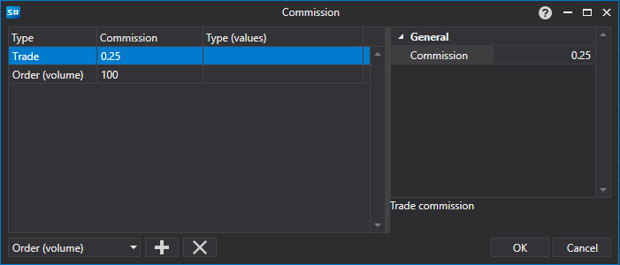

# 佣金设置窗口

[CommissionWindow](xref:StockSharp.Xaml.CommissionWindow) - 一个用于设置佣金收取规则的特殊窗口。



下面是调用用于设置佣金收取规则的窗口的代码示例。

```cs
		private void RiskButton_OnClick(object sender, RoutedEventArgs e)
		{
			var wnd = new CommissionWindow();
			wnd.Rules.AddRange(Strategy.RiskManager.Rules.Select(r => r.Clone()));
			if (!wnd.ShowModal(this))
				return;
			Strategy.RiskManager.Rules.Clear();
			Strategy.RiskManager.Rules.AddRange(wnd.Rules);
		}
	  				
```
