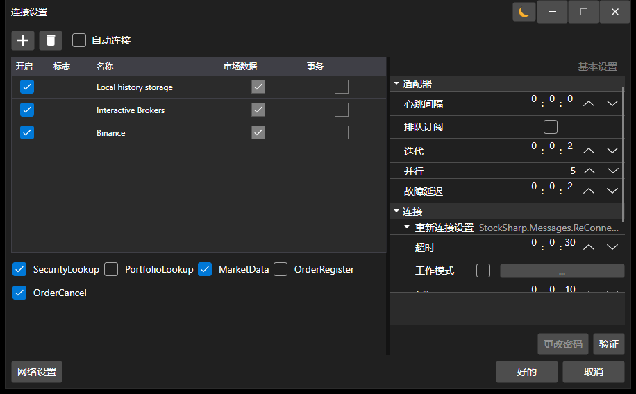

# 连接设置窗口

[ConnectorWindow](xref:StockSharp.Xaml.ConnectorWindow) - 一个用于配置连接器适配器的特殊窗口。



这是连接设置窗口。从下拉列表（通过 '+' 按钮打开）中，您需要选择所需的适配器，并在右侧的属性窗口中配置它们的属性。

此窗口应通过 [Extensions.Configure](xref:StockSharp.Xaml.Extensions.Configure(StockSharp.Algo.Connector,System.Windows.Window))**(**[StockSharp.Algo.Connector](xref:StockSharp.Algo.Connector) connector, [System.Windows.Window](xref:System.Windows.Window) owner **)** 扩展方法调用，并传入 [Connector](xref:StockSharp.Algo.Connector) 和父窗口。如果配置成功，[Extensions.Configure](xref:StockSharp.Xaml.Extensions.Configure(StockSharp.Algo.Connector,System.Windows.Window))**(**[StockSharp.Algo.Connector](xref:StockSharp.Algo.Connector) connector, [System.Windows.Window](xref:System.Windows.Window) owner **)** 扩展方法将返回 'true'。下面是调用连接器连接设置窗口并将设置保存到文件的代码。

```cs
		private void Setting_Click(object sender, RoutedEventArgs e)
		{
			if (_connector.Configure(this))
			{
				new JsonSerializer<SettingsStorage>().Serialize(_connector.Save(), _connectorFile);
			}
		}
	  				
```

> [!TIP]
> 可以使用 **检查** 按钮来检查连接是否正确。

此窗口的结果是创建并将适配器添加到 [Connector.Adapter](xref:StockSharp.Algo.Connector.Adapter) 属性的*内部适配器*列表中。

有关保存和加载连接器设置的更多信息，请参阅 [保存和加载设置](../connectors/save_and_load_settings.md)。
