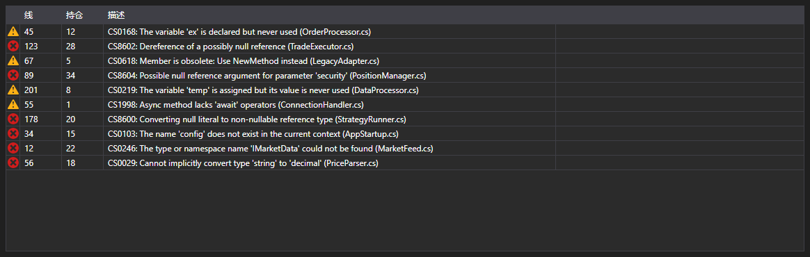

# 编译错误



[ErrorsGrid](xref:StockSharp.Xaml.Code.ErrorsGrid) - 编译错误表格。对每条 [CompilationError](xref:Ecng.Compilation.CompilationError) 记录显示类型（错误、警告、消息）、行号、行内位置和文本。

**主要属性**

- [ErrorsGrid.Errors](xref:StockSharp.Xaml.Code.ErrorsGrid.Errors) - 编译错误列表。

双击某一行会触发 `ErrorSelected` 事件，代码编辑器据此把光标移动到该行。这样表格与编辑器就构成了常见的“错误列表—跳转到出错位置”组合。

下面是其使用的代码片段:

```xaml
<Window x:Class="Sample.CompilationWindow"
	xmlns="http://schemas.microsoft.com/winfx/2006/xaml/presentation"
	xmlns:x="http://schemas.microsoft.com/winfx/2006/xaml"
	xmlns:code="clr-namespace:StockSharp.Xaml.Code;assembly=StockSharp.Xaml"
	Height="200" Width="800">
	<code:ErrorsGrid x:Name="ErrorsGrid" />
</Window>
```

```cs
// 显示编译结果
var result = compiler.Compile("Strategy", sources, references);

ErrorsGrid.Errors.Clear();
ErrorsGrid.Errors.AddRange(result.Errors);

// 双击跳转到出错的行
ErrorsGrid.ErrorSelected += error => CodePanel.Code.SelectLine(error.Line);
```

## 另请参阅

[诊断](../diagnostics.md)
