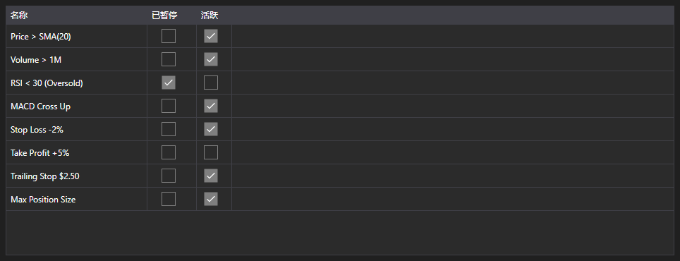

# 活动规则



[MarketRuleGrid](xref:StockSharp.Xaml.MarketRuleGrid) - 由策略或连接器创建的 [IMarketRule](xref:StockSharp.Algo.IMarketRule) 规则表格。显示规则名称、暂停标志和活动标志。

**主要属性**

- [MarketRuleGrid.Rules](xref:StockSharp.Xaml.MarketRuleGrid.Rules) - 规则列表，通常是 [Strategy.Rules](xref:StockSharp.Algo.Strategies.Strategy.Rules)。

当规则数量很多、需要判断哪些仍然存活时，这张表格很有用。规则一旦触发并被移除就会从列表中消失，因此泄漏一眼可见：本应被移除却仍然留下的规则。

下面是其使用的代码片段:

```xaml
<Window x:Class="Sample.RulesWindow"
	xmlns="http://schemas.microsoft.com/winfx/2006/xaml/presentation"
	xmlns:x="http://schemas.microsoft.com/winfx/2006/xaml"
	xmlns:xaml="http://schemas.stocksharp.com/xaml"
	Height="300" Width="600">
	<xaml:MarketRuleGrid x:Name="RuleGrid" />
</Window>
```

```cs
// 显示策略的规则
RuleGrid.Rules = _strategy.Rules;

// 创建的每条规则都会出现在表格中
_strategy
	.WhenPositionChanged()
	.Do(() => LogInfo("position={0}", _strategy.Position))
	.Apply(_strategy);
```

## 另请参阅

[诊断](../diagnostics.md)
