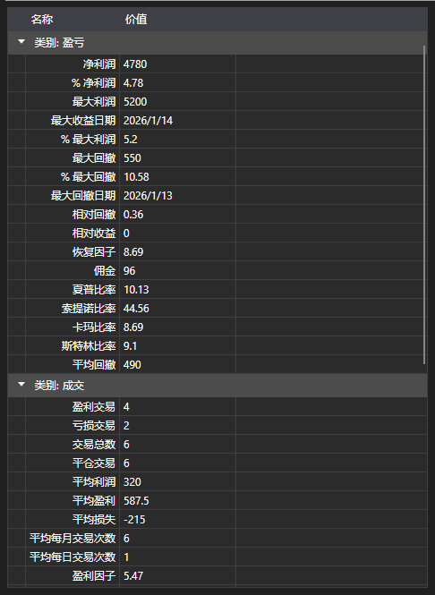

# 策略统计



[StatisticParameterGrid](xref:StockSharp.Xaml.StatisticParameterGrid) - 单个策略的统计参数 [IStatisticParameter](xref:StockSharp.Algo.Statistics.IStatisticParameter) 表格。参数按类别分组（成交、订单、收益、回撤），每一行显示名称、当前值和说明。

**主要属性和方法**

- [StatisticParameterGrid.StatisticManager](xref:StockSharp.Xaml.StatisticParameterGrid.StatisticManager) - 表格所显示参数的统计管理器。通常是 [Strategy.StatisticManager](xref:StockSharp.Algo.Strategies.Strategy.StatisticManager)。
- [StatisticParameterGrid.Parameters](xref:StockSharp.Xaml.StatisticParameterGrid.Parameters) - 参数列表，用于直接指定而不经过管理器的情况。
- [StatisticParameterGrid.Reset](xref:StockSharp.Xaml.StatisticParameterGrid.Reset) - 重置已累积的数值。

数值会随着策略的运行而更新，因此这张表格通常放在图表旁边：图表显示交易是如何进行的，表格显示它的代价是多少。重新执行同一次计算之前需要调用 `Reset`，否则新的数值会叠加在旧的数值之上。

与按相同的列比较多个策略的 [StrategiesStatisticsPanel](xref:StockSharp.Xaml.StrategiesStatisticsPanel) 不同，这张表格完整地剖析单个策略。

下面是其使用的代码片段:

```xaml
<Window x:Class="Sample.StatisticsWindow"
	xmlns="http://schemas.microsoft.com/winfx/2006/xaml/presentation"
	xmlns:x="http://schemas.microsoft.com/winfx/2006/xaml"
	xmlns:xaml="http://schemas.stocksharp.com/xaml"
	Height="500" Width="400">
	<xaml:StatisticParameterGrid x:Name="StatisticGrid" />
</Window>
```

```cs
// 显示策略的统计
StatisticGrid.StatisticManager = _strategy.StatisticManager;

// 重新执行之前重置已累积的数值
StatisticGrid.Reset();
```

## 另请参阅

[诊断](../diagnostics.md)

[统计](../strategies/statistics.md)
