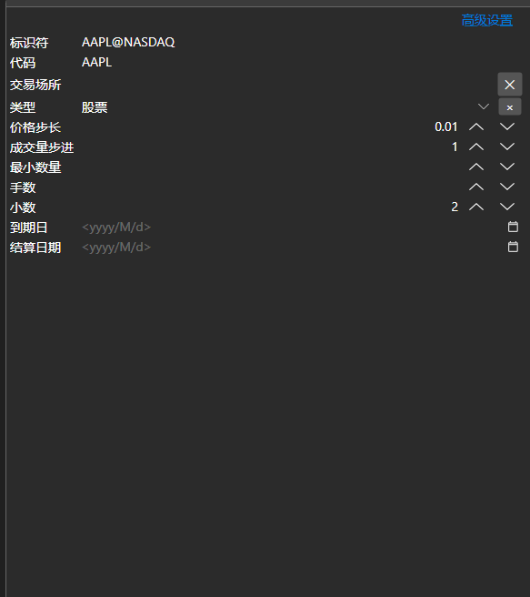
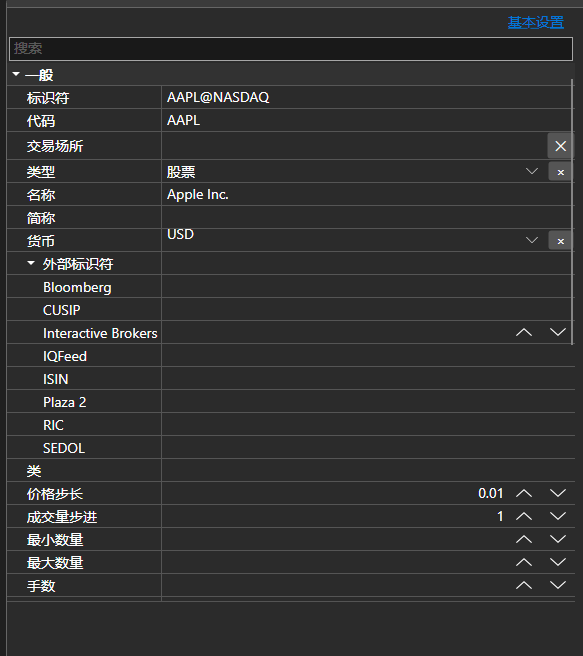

# 基本属性与高级属性





[BasicAdvPropertiesPanel](xref:StockSharp.Xaml.PropertyGrid.BasicAdvPropertiesPanel) - 带两种模式的属性面板。基本模式只显示必填字段的简短列表，高级模式按类别显示对象的全部属性。

**主要属性**

- [BasicAdvPropertiesPanel.SelectedObject](xref:StockSharp.Xaml.PropertyGrid.BasicAdvPropertiesPanel.SelectedObject) - 正在编辑的对象。
- [BasicAdvPropertiesPanel.IsAdvancedMode](xref:StockSharp.Xaml.PropertyGrid.BasicAdvPropertiesPanel.IsAdvancedMode) - 是否处于高级模式。
- [BasicAdvPropertiesPanel.PlainMaxDepth](xref:StockSharp.Xaml.PropertyGrid.BasicAdvPropertiesPanel.PlainMaxDepth) - 基本模式下嵌套属性的展开深度。
- [BasicAdvPropertiesPanel.PostImmediately](xref:StockSharp.Xaml.PropertyGrid.BasicAdvPropertiesPanel.PostImmediately) - 输入时立即应用取值，而不等待离开该字段。

两种模式解决了连接器设置的常见问题：必填字段只有三四个，而属性总数有几十个。基本模式只显示连接所必需的内容，其余仍可在高级模式中访问。

下面是其使用的代码片段:

```xaml
<Window x:Class="Sample.SettingsWindow"
	xmlns="http://schemas.microsoft.com/winfx/2006/xaml/presentation"
	xmlns:x="http://schemas.microsoft.com/winfx/2006/xaml"
	xmlns:pg="clr-namespace:StockSharp.Xaml.PropertyGrid;assembly=StockSharp.Xaml"
	Height="500" Width="400">
	<pg:BasicAdvPropertiesPanel x:Name="PropertiesPanel" />
</Window>
```

```cs
// 显示适配器的属性
PropertiesPanel.SelectedObject = _adapter;

// 切换到高级模式
PropertiesPanel.IsAdvancedMode = true;

// 标记设置已被修改
PropertiesPanel.CellValueChanged += (sender, e) => _isModified = true;
```

## 另请参阅

[值编辑器](../editors.md)
