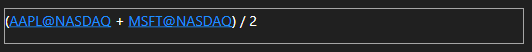

# 索引

[IndexEditor](xref:StockSharp.Xaml.IndexEditor) - 用于编辑 [ExpressionIndexSecurity](xref:StockSharp.Algo.Expressions.ExpressionIndexSecurity) 的图形控制。

[ExpressionIndexSecurity](xref:StockSharp.Algo.Expressions.ExpressionIndexSecurity) - 是一种基于使用数学公式组合多种交易品种的特殊类型的指数交易品种。此类型具有 [ExpressionIndexSecurity.Expression](xref:StockSharp.Algo.Expressions.ExpressionIndexSecurity.Expression) 属性，该属性以文本形式存储公式以及基础 [ExpressionIndexSecurity.InnerSecurityIds](xref:StockSharp.Algo.Expressions.ExpressionIndexSecurity.InnerSecurityIds) 交易品种的列表。



**基本属性**

- [IndexEditor.Securities](xref:StockSharp.Xaml.IndexEditor.Securities) - 所有可用交易品种。
- [IndexEditor.Text](xref:StockSharp.Xaml.IndexEditor.Text) - 指数的数学公式。

要使用 [IndexEditor](xref:StockSharp.Xaml.IndexEditor)，首先你需要注册一个特殊服务：

```cs
...
ConfigManager.RegisterService<ICompilerService>(new RoslynCompilerService());
...
```

接下来，用于指数计算的交易品种应传递给 [IndexEditor](xref:StockSharp.Xaml.IndexEditor) ：

```cs
...
IndexEditor.Securities.AddRange(SecurityProvider.LookupAll());
SecurityProvider.Added += OnAdded;
...
private void OnAdded(IEnumerable<Security> securities)
		{
			IndexEditor.Securities.AddRange(securities);
		}
```
