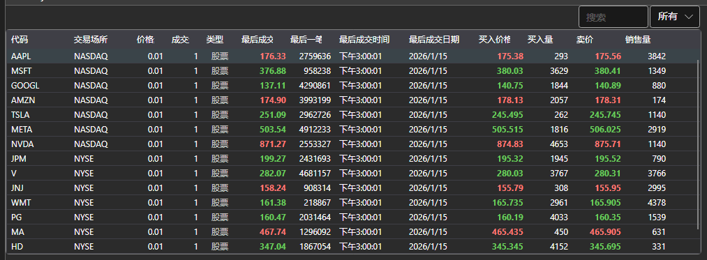

# 选择器

[SecurityPicker](xref:StockSharp.Xaml.SecurityPicker) 组件用于查找和选择交易品种。它支持单选和多选。该组件允许您按交易品种类型过滤交易品种列表。此组件还可以用于显示财务信息（一级字段），如[表格](table.md)部分所示。



[SecurityPicker](xref:StockSharp.Xaml.SecurityPicker) 由以下部分组成：

1. 一个文本字段，用于输入交易品种的代码（或编号）。输入后，列表将根据输入的子字符串进行过滤。
2. 用于按类型筛选交易品种的特殊 [SecurityTypeComboBox](xref:StockSharp.Xaml.SecurityTypeComboBox) 下拉框。
3. 显示交易品种列表的 [SecurityGrid](xref:StockSharp.Xaml.SecurityGrid) 表。

**主要属性**

- [SecurityPicker.SelectionMode](xref:StockSharp.Xaml.SecurityPicker.SelectionMode) - 交易品种选择模式：单个，多个。
- [SecurityPicker.ShowCommonStatColumns](xref:StockSharp.Xaml.SecurityPicker.ShowCommonStatColumns) - 显示主要列。
- [SecurityPicker.ShowCommonOptionColumns](xref:StockSharp.Xaml.SecurityPicker.ShowCommonOptionColumns) - 显示选项的主要列。
- [SecurityPicker.Title](xref:StockSharp.Xaml.SecurityPicker.Title) - 显示在组件顶部的标题。
- [SecurityPicker.Securities](xref:StockSharp.Xaml.SecurityPicker.Securities) - 交易品种列表。
- [SecurityPicker.SelectedSecurity](xref:StockSharp.Xaml.SecurityPicker.SelectedSecurity) - 所选交易品种。
- [SecurityPicker.SelectedSecurities](xref:StockSharp.Xaml.SecurityPicker.SelectedSecurities) - 所选交易品种列表。
- [SecurityPicker.FilteredSecurities](xref:StockSharp.Xaml.SecurityPicker.FilteredSecurities) - 筛选过的交易品种列表。
- [SecurityPicker.ExcludeSecurities](xref:StockSharp.Xaml.SecurityPicker.ExcludeSecurities) - 隐藏交易品种的列表。
- [SecurityPicker.SelectedType](xref:StockSharp.Xaml.SecurityPicker.SelectedType) - 所选的交易品种类型。
- [SecurityPicker.SecurityProvider](xref:StockSharp.Xaml.SecurityPicker.SecurityProvider) - 关于交易品种信息的提供者。
- [SecurityPicker.MarketDataProvider](xref:StockSharp.Xaml.SecurityPicker.MarketDataProvider) - 市场数据提供商。

下面是代码片段及其用法，摘自示例 *Samples/InteractiveBrokers/SampleIB*。

```xaml
<Window x:Class="Sample.SecuritiesWindow"
	xmlns="http://schemas.microsoft.com/winfx/2006/xaml/presentation"
	xmlns:x="http://schemas.microsoft.com/winfx/2006/xaml"
	xmlns:loc="clr-namespace:StockSharp.Localization;assembly=StockSharp.Localization"
	xmlns:xaml="http://schemas.stocksharp.com/xaml"
	Title="{x:Static loc:LocalizedStrings.Securities}" Height="415" Width="1081">
	<Grid>
		<Grid.RowDefinitions>
			<RowDefinition Height="*" />
			<RowDefinition Height="Auto" />
		</Grid.RowDefinitions>
		<xaml:SecurityPicker x:Name="SecurityPicker" x:FieldModifier="public" SecuritySelected="SecurityPicker_OnSecuritySelected" ShowCommonStatColumns="True" />
	</Grid>
</Window>
	  	
```
```cs
private void ConnectClick(object sender, RoutedEventArgs e)
{
	......................................
	_connector.SecurityReceived += (sub, security) => _securitiesWindow.SecurityPicker.Securities.Add(security);
	_securitiesWindow.SecurityPicker.MarketDataProvider = _connector;
	......................................
}
private void SecurityPicker_OnSecuritySelected(Security security)
{
	NewStopOrder.IsEnabled = NewOrder.IsEnabled =
	Level1.IsEnabled = Depth.IsEnabled = security != null;
}
```
