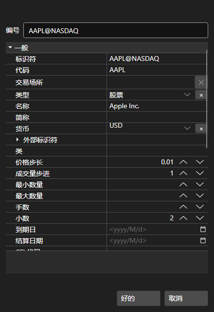

# 窗户

[SecurityCreateWindow](xref:StockSharp.Xaml.SecurityCreateWindow) 组件是用于创建和编辑一种工具的窗口。该组件由两个主要元素组成：特殊文本字段 [SecurityIdTextBox](xref:StockSharp.Xaml.SecurityIdTextBox) 和属性编辑网格 [PropertyGridEx](xref:StockSharp.Xaml.PropertyGrid.PropertyGridEx)。您可以通过 [SecurityCreateWindow.Security](xref:StockSharp.Xaml.SecurityCreateWindow.Security) 属性访问创建（编辑）的工具。

下面是组件的外观以及使用该组件的代码片段。



```cs
private void Button_Click(object sender, RoutedEventArgs e)
{
	var dlg = new SecurityCreateWindow();
	var result = dlg.ShowDialog();
	if (result != null && (bool)result)
	{
		var security = dlg.Security;
	}
}
	
```
