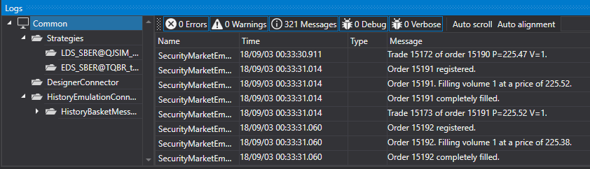

# 扩展日志面板

[监视器](xref:StockSharp.Xaml.Monitor) - 是一个视觉元素，其中 [LogControl](log_panel.md) 与 **TreeView** 分层树结合使用，用于显示日志来源。最初，该组件设计用于监控交易策略。因此，默认情况下，“树”包含 **Strategy** 节点。同时，该组件也可以与其他来源一起使用。



示例代码

```xaml
<Window x:Class="LoggingControls.MainWindow"
		xmlns="http://schemas.microsoft.com/winfx/2006/xaml/presentation"
		xmlns:x="http://schemas.microsoft.com/winfx/2006/xaml"
		xmlns:sx="clr-namespace:StockSharp.Xaml;assembly=StockSharp.Xaml"
		Title="MainWindow" Height="350" Width="525">
	<Grid>
		<sx:Monitor x:Name="Monitor" />
	</Grid>
</Window>
				
```
```cs
// creating a new instance of LogManager
_logManager = new LogManager();
// adding .NET tracing as a log source.
_logManager.Sources.Add(new Ecng.Logging.TraceSource());
// adding Monitor as a log listener.
_logManager.Listeners.Add(new GuiLogListener(Monitor));
					
```
