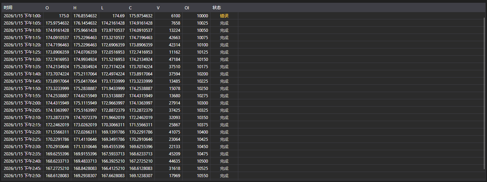

# K线



[CandleMessageGrid](xref:StockSharp.Xaml.CandleMessageGrid) - K线表格。显示每根K线的开盘价、最高价、最低价、收盘价、成交量、持仓量和状态。

**主要属性**

- [CandleMessageGrid.Messages](xref:StockSharp.Xaml.CandleMessageGrid.Messages) - K线列表。
- [CandleMessageGrid.SelectedMessage](xref:StockSharp.Xaml.CandleMessageGrid.SelectedMessage) - 选中的K线。
- [CandleMessageGrid.SelectedMessages](xref:StockSharp.Xaml.CandleMessageGrid.SelectedMessages) - 选中的多根K线。

## K线状态

**State** 列按 [CandleStates](xref:StockSharp.Messages.CandleStates) 的值着色，截图中三种状态都能看到:

- **Active** - K线仍在形成。之所以高亮，是因为它的数值还会变化: 这样的K线不能当作已完成的来读。
- **Finished** - K线已收盘，数值已最终确定。中性颜色，表中大多数行都是这种。
- **None** - 没有收到状态。表格标记为 **错误** 并按警告着色: 这不是空值，而是数据不完整的标志。

因此，第一行显示 **错误** 的K线订阅报告的是数据源的问题，而不是一根没有状态的K线。

以下是使用示例代码片段:

```xaml
<Window x:Class="Sample.CandlesWindow"
	xmlns="http://schemas.microsoft.com/winfx/2006/xaml/presentation"
	xmlns:x="http://schemas.microsoft.com/winfx/2006/xaml"
	xmlns:xaml="http://schemas.stocksharp.com/xaml"
	Title="K线" Height="400" Width="800">
	<xaml:CandleMessageGrid x:Name="CandleGrid" x:FieldModifier="public" />
</Window>
```

```cs
public class CandlesWindow
{
	private readonly Connector _connector;
	private readonly Security _security;
	private Subscription _candleSubscription;

	public CandlesWindow(Connector connector, Security security)
	{
		InitializeComponent();

		_connector = connector;
		_security = security;

		// 订阅K线接收事件
		_connector.CandleReceived += OnCandleReceived;

		// 创建五分钟K线订阅
		_candleSubscription = new Subscription(TimeSpan.FromMinutes(5).TimeFrame(), security);

		// 启动订阅
		_connector.Subscribe(_candleSubscription);
	}

	// K线接收处理程序
	private void OnCandleReceived(Subscription subscription, ICandleMessage candle)
	{
		// 检查该K线是否属于我们的订阅
		if (subscription != _candleSubscription)
			return;

		// 在界面线程中把K线加入表格
		this.GuiAsync(() => CandleGrid.Messages.Add((CandleMessage)candle));
	}

	// 关闭窗口时取消订阅
	public void Unsubscribe()
	{
		if (_candleSubscription != null)
		{
			_connector.CandleReceived -= OnCandleReceived;
			_connector.UnSubscribe(_candleSubscription);
			_candleSubscription = null;
		}
	}
}
```

### 仅已完成的K线

K线在收盘前会多次到达，每次更新表格都会增长。如果只关心最终数值，请按状态过滤:

```cs
private void OnCandleReceived(Subscription subscription, ICandleMessage candle)
{
	if (subscription != _candleSubscription)
		return;

	// 跳过所有仍在形成的K线
	if (candle.State != CandleStates.Finished)
		return;

	this.GuiAsync(() => CandleGrid.Messages.Add((CandleMessage)candle));
}
```

### 就地更新当前K线

若要让当前K线留在表中并被更新而不是重复添加，在K线收盘前替换最后一行:

```cs
private void OnCandleReceived(Subscription subscription, ICandleMessage candle)
{
	if (subscription != _candleSubscription)
		return;

	var message = (CandleMessage)candle;

	this.GuiAsync(() =>
	{
		var last = CandleGrid.Messages.LastOrDefault();

		// 与最后一行是同一根K线 - 直接替换
		if (last != null && last.OpenTime == message.OpenTime)
			CandleGrid.Messages[CandleGrid.Messages.Count - 1] = message;
		else
			CandleGrid.Messages.Add(message);
	});
}
```

### 加载历史K线

```cs
// 加载历史K线
public void LoadHistoricalCandles(Security security, TimeSpan timeFrame, DateTime from, DateTime to)
{
	// 清空当前K线
	CandleGrid.Messages.Clear();

	// 创建历史K线订阅
	var historySubscription = new Subscription(timeFrame.TimeFrame(), security)
	{
		MarketData =
		{
			// 指定请求历史数据的时间段
			From = from,
			To = to
		}
	};

	_connector.CandleReceived += OnCandleReceived;
	_connector.Subscribe(historySubscription);
}
```

## 另请参阅

[逐笔成交](ticks.md)
