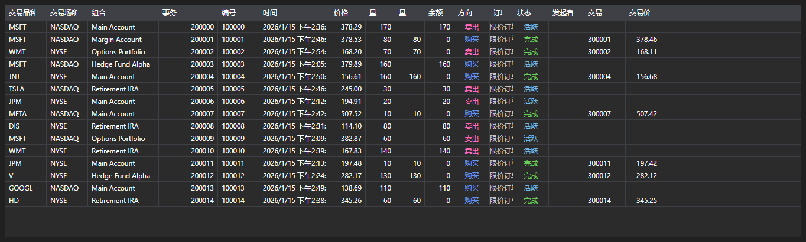

# 交易事务与成交



[ExecutionGrid](xref:StockSharp.Xaml.ExecutionGrid) - [ExecutionMessage](xref:StockSharp.Messages.ExecutionMessage) 消息的通用表格。一个控件即可显示逐笔成交、订单日志和自有交易事务，数据类型由 [ExecutionMessage.DataTypeEx](xref:StockSharp.Messages.ExecutionMessage.DataTypeEx) 决定。

**主要属性**

- [ExecutionGrid.Messages](xref:StockSharp.Xaml.ExecutionGrid.Messages) - 消息列表。
- [ExecutionGrid.SelectedMessage](xref:StockSharp.Xaml.ExecutionGrid.SelectedMessage) - 选中的消息。
- [ExecutionGrid.SelectedMessages](xref:StockSharp.Xaml.ExecutionGrid.SelectedMessages) - 选中的多条消息。
- [ExecutionGrid.MaxCount](xref:StockSharp.Xaml.ExecutionGrid.MaxCount) - 表格的最大行数，超出后会删除最早的行。

由于同一表格服务于三类数据，多余的列通过 [ExecutionGrid.HideColumns](xref:StockSharp.Xaml.ExecutionGrid.HideColumns(StockSharp.Messages.DataType)) 隐藏：逐笔成交不需要订单列，订单日志不需要自有成交列。

下面是其使用的代码片段:

```xaml
<Window x:Class="Sample.ExecutionsWindow"
	xmlns="http://schemas.microsoft.com/winfx/2006/xaml/presentation"
	xmlns:x="http://schemas.microsoft.com/winfx/2006/xaml"
	xmlns:xaml="http://schemas.stocksharp.com/xaml"
	Height="400" Width="900">
	<xaml:ExecutionGrid x:Name="ExecutionGrid" />
</Window>
```

```cs
// 只保留与交易事务相关的列
ExecutionGrid.HideColumns(DataType.Transactions);

// 在界面线程中把订单添加到表格
_connector.OrderReceived += (subscription, order) =>
	this.GuiAsync(() => ExecutionGrid.Messages.Add(order.ToMessage()));

// 限制表格大小
ExecutionGrid.MaxCount = 100000;
```

## 另请参阅

[市场数据](../market_data.md)
