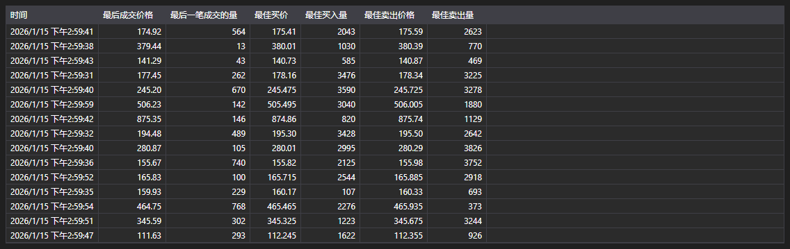

# 等级1



[Level1Grid](xref:StockSharp.Xaml.Level1Grid) - 一个用于显示 Level1 字段的表格。该表格使用 [Level1ChangeMessage](xref:StockSharp.Messages.Level1ChangeMessage) 消息形式的数据。

**主要属性**

- [Level1Grid.MaxCount](xref:StockSharp.Xaml.Level1Grid.MaxCount) - 要显示的最大消息数量。
- [Level1Grid.Messages](xref:StockSharp.Xaml.Level1Grid.Messages) - 添加到表中的消息列表。
- [Level1Grid.SelectedMessage](xref:StockSharp.Xaml.Level1Grid.SelectedMessage) - 已选择的消息。
- [Level1Grid.SelectedMessages](xref:StockSharp.Xaml.Level1Grid.SelectedMessages) - 已选择的消息。

以下是展示其用法的代码片段：

```xaml
<Window x:Class="Membrane02.Level1Window"
		xmlns="http://schemas.microsoft.com/winfx/2006/xaml/presentation"
		xmlns:x="http://schemas.microsoft.com/winfx/2006/xaml"
		xmlns:d="http://schemas.microsoft.com/expression/blend/2008"
		xmlns:mc="http://schemas.openxmlformats.org/markup-compatibility/2006"
		xmlns:sx="http://schemas.stocksharp.com/xaml"
		xmlns:local="clr-namespace:Membrane02"
		mc:Ignorable="d"
		Title="Level1Window" Height="300" Width="300" Closing="Window_Closing">
	<Grid>
		<sx:Level1Grid x:Name="Level1Grid" />
	</Grid>
</Window>
```

```cs
public Level1Window()
{
	InitializeComponent();
	_connector = MainWindow.This.Connector;
	
	// 订阅 Level1 数据接收事件
	_connector.Level1Received += OnLevel1Received;
	
	// 如果尚未订阅，则创建 Level1 数据订阅
	var security = MainWindow.This.SelectedSecurity;
	if (!_connector.Subscriptions.Any(s => 
			s.DataType == DataType.Level1 && 
			s.SecurityId == security.ToSecurityId()))
	{
		var subscription = new Subscription(DataType.Level1, security);
		_connector.Subscribe(subscription);
	}
}

private void OnLevel1Received(Subscription subscription, Level1ChangeMessage level1Message)
{
	// 检查消息是否属于所选交易品种
	if (level1Message.SecurityId != MainWindow.This.SelectedSecurity.ToSecurityId())
		return;
		
	// 将消息添加到 Level1Grid
	this.GuiAsync(() => Level1Grid.Messages.Add(level1Message));
}

private void Window_Closing(object sender, System.ComponentModel.CancelEventArgs e)
{
	// 窗口关闭时取消事件订阅
	if (_connector != null)
		_connector.Level1Received -= OnLevel1Received;
}
```

### 处理一级数据的推荐方法

```cs
// 使用多个交易品种创建 Level1 订阅
public void SubscribeToLevel1(IEnumerable<Security> securities)
{
	foreach (var security in securities)
	{
		var subscription = new Subscription(DataType.Level1, security);
		_connector.Subscribe(subscription);
	}
	
	// 订阅 Level1 数据接收事件
	_connector.Level1Received += OnLevel1Received;
}

// Level1 数据接收事件处理器
private void OnLevel1Received(Subscription subscription, Level1ChangeMessage level1Message)
{
	// 检查是否需要处理此特定消息
	if (IsLevel1Needed(subscription))
	{
		// 在用户界面线程中更新 GUI
		this.GuiAsync(() => 
		{
			// 将消息添加到 Level1Grid
			Level1Grid.Messages.Add(level1Message);
			
			// 处理 Level1 字段变更
			foreach (var change in level1Message.Changes)
			{
				switch (change.Key)
				{
					case Level1Fields.LastTradePrice:
						// 处理最新成交价变更
						var lastPrice = (decimal)change.Value;
						Console.WriteLine($"Last price {security.Code}: {lastPrice}");
						break;
						
					case Level1Fields.BestBidPrice:
						// 处理最佳 bid 价格变更
						var bestBid = (decimal)change.Value;
						Console.WriteLine($"最优买价 {security.Code}: {bestBid}");
						break;
						
					case Level1Fields.BestAskPrice:
						// 处理最佳 ask 价格变更
						var bestAsk = (decimal)change.Value;
						Console.WriteLine($"最优卖价 {security.Code}: {bestAsk}");
						break;
				}
			}
		});
	}
}
```
