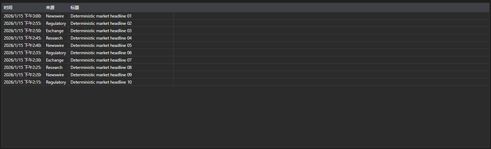
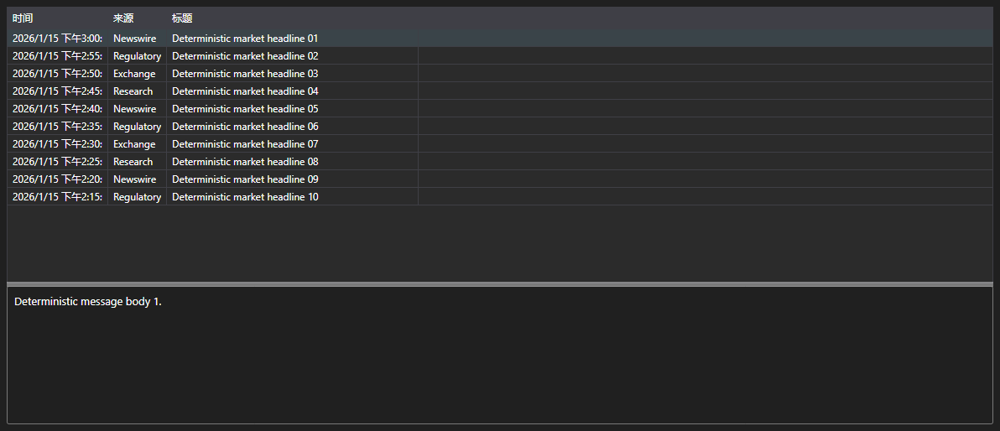

# 消息形式的新闻





[NewsMessageGrid](xref:StockSharp.Xaml.NewsMessageGrid) - 处理 [NewsMessage](xref:StockSharp.Messages.NewsMessage) 消息而非业务实体的新闻表格。显示时间、来源、标识符、标题以及完整正文的链接。

**主要属性**

- [NewsMessageGrid.Messages](xref:StockSharp.Xaml.NewsMessageGrid.Messages) - 新闻消息列表。
- [NewsMessageGrid.SelectedMessage](xref:StockSharp.Xaml.NewsMessageGrid.SelectedMessage) - 选中的消息。
- [NewsMessageGrid.SelectedMessages](xref:StockSharp.Xaml.NewsMessageGrid.SelectedMessages) - 选中的多条消息。
- [NewsMessageGrid.MaxCount](xref:StockSharp.Xaml.NewsMessageGrid.MaxCount) - 表格的最大行数，超出后会删除最早的行。
- [NewsMessageGrid.SubscriptionProvider](xref:StockSharp.Xaml.NewsMessageGrid.SubscriptionProvider) - 表格向其请求新闻正文的订阅提供者。

表格与正文的现成组合是 [NewsMessagePanel](xref:StockSharp.Xaml.NewsMessagePanel)。它包含 [NewsMessageGrid](xref:StockSharp.Xaml.NewsMessageGrid) 和 [NewsStoryPanel](xref:StockSharp.Xaml.NewsStoryPanel)：选中某行时面板会向订阅提供者请求正文并显示在下方。

下面是其使用的代码片段:

```xaml
<Window x:Class="Sample.NewsWindow"
	xmlns="http://schemas.microsoft.com/winfx/2006/xaml/presentation"
	xmlns:x="http://schemas.microsoft.com/winfx/2006/xaml"
	xmlns:xaml="http://schemas.stocksharp.com/xaml"
	Height="400" Width="900">
	<xaml:NewsMessagePanel x:Name="NewsPanel" />
</Window>
```

```cs
// 设置订阅提供者，新闻正文通过它请求
NewsPanel.SubscriptionProvider = _connector;

// 在界面线程中把收到的新闻添加到表格
_connector.NewsReceived += (subscription, news) =>
	this.GuiAsync(() => NewsPanel.NewsGrid.Messages.Add(news.ToMessage()));

// 创建新闻订阅
_connector.Subscribe(new Subscription(DataType.News));
```

## 另请参阅

[市场数据](../market_data.md)
