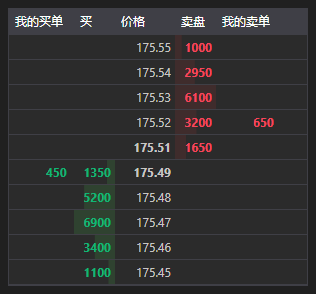

# 订单簿



[MarketDepthControl](xref:StockSharp.Xaml.MarketDepthControl) - 一个用于显示订单簿的图形组件。该组件允许显示报价和自己的订单。

**主要属性和方法**

- [MarketDepthControl.MaxDepth](xref:StockSharp.Xaml.MarketDepthControl.MaxDepth) - 订单簿深度。
- [MarketDepthControl.IsBidsOnTop](xref:StockSharp.Xaml.MarketDepthControl.IsBidsOnTop) - 将出价显示在顶部。
- [MarketDepthControl.UpdateFormat](xref:StockSharp.Xaml.MarketDepthControl.UpdateFormat(StockSharp.BusinessEntities.Security))**(**[StockSharp.BusinessEntities.Security](xref:StockSharp.BusinessEntities.Security) security **)** - 使用该交易品种更新价格和成交量显示格式。
- [MarketDepthControl.ProcessOrder](xref:StockSharp.Xaml.MarketDepthControl.ProcessOrder(StockSharp.BusinessEntities.Order,System.Decimal,System.Decimal,StockSharp.Messages.OrderStates))**(**[StockSharp.BusinessEntities.Order](xref:StockSharp.BusinessEntities.Order) 订单, [System.Decimal](xref:System.Decimal) 价格, [System.Decimal](xref:System.Decimal) 余额, [StockSharp.Messages.OrderStates](xref:StockSharp.Messages.OrderStates) 状态 **)** - 处理订单。
- [MarketDepthControl.UpdateDepth](xref:StockSharp.Xaml.MarketDepthControl.UpdateDepth(StockSharp.Messages.IOrderBookMessage,StockSharp.BusinessEntities.Security))**(**[StockSharp.Messages.IOrderBookMessage](xref:StockSharp.Messages.IOrderBookMessage) 消息, [StockSharp.BusinessEntities.Security](xref:StockSharp.BusinessEntities.Security) 安全 **)** - 使用消息更新订单簿。

以下是展示其用法的代码片段：

```xaml
<Window x:Class="SampleBarChart.QuotesWindow"
	xmlns="http://schemas.microsoft.com/winfx/2006/xaml/presentation"
	xmlns:x="http://schemas.microsoft.com/winfx/2006/xaml"
	xmlns:xaml="http://schemas.stocksharp.com/xaml"
	Title="QuotesWindow" Height="600" Width="280">
	<xaml:MarketDepthControl x:Name="DepthCtrl" x:FieldModifier="public" />
</Window>
```

```cs
public class MarketDepthWindow
{
	private readonly Connector _connector;
	private readonly Security _security;
	private Subscription _depthSubscription;
	
	public MarketDepthWindow(Connector connector, Security security)
	{
		InitializeComponent();
		
		_connector = connector;
		_security = security;
		
		// 配置订单簿格式
		DepthCtrl.UpdateFormat(security);
		
		// 订阅订单簿接收事件
		_connector.OrderBookReceived += OnMarketDepthReceived;
		
		// 为所选交易品种创建订单簿订阅
		_depthSubscription = new Subscription(DataType.MarketDepth, security);
		
		// 启动订阅
		_connector.Subscribe(_depthSubscription);
	}
	
	// 订单簿接收事件处理器
	private void OnMarketDepthReceived(Subscription subscription, IOrderBookMessage depth)
	{
		// 检查订单簿是否属于我们的订阅
		if (subscription != _depthSubscription)
			return;
			
		// 在用户界面线程中更新订单簿
		this.GuiAsync(() => DepthCtrl.UpdateDepth(depth, _security));
	}
	
	// 窗口关闭时取消订阅的方法
	public void Unsubscribe()
	{
		if (_depthSubscription != null)
		{
			_connector.OrderBookReceived -= OnMarketDepthReceived;
			_connector.UnSubscribe(_depthSubscription);
			_depthSubscription = null;
		}
	}
}
```

### 在订单簿中显示自己的订单

```cs
public class MarketDepthWithOrdersWindow
{
	private readonly Connector _connector;
	private readonly Security _security;
	
	public MarketDepthWithOrdersWindow(Connector connector, Security security)
	{
		InitializeComponent();
		
		_connector = connector;
		_security = security;
		
		// 配置订单簿格式
		DepthCtrl.UpdateFormat(security);
		
		// 订阅订单簿和订单接收事件
		_connector.OrderBookReceived += OnMarketDepthReceived;
		_connector.OrderReceived += OnOrderReceived;
		
		// 创建订单簿订阅
		var depthSubscription = new Subscription(DataType.MarketDepth, security);
		_connector.Subscribe(depthSubscription);
		
		// 如有必要，创建订单订阅
		var ordersSubscription = new Subscription(DataType.Transactions, null);
		_connector.Subscribe(ordersSubscription);
	}
	
	// 订单簿接收事件处理器
	private void OnMarketDepthReceived(Subscription subscription, IOrderBookMessage depth)
	{
		if (depth.SecurityId != _security.ToSecurityId())
			return;
			
		// 在用户界面线程中更新订单簿
		this.GuiAsync(() => DepthCtrl.UpdateDepth(depth, _security));
	}
	
	// 订单接收事件处理器
	private void OnOrderReceived(Subscription subscription, Order order)
	{
		if (order.Security != _security)
			return;
			
		// 在订单簿中显示订单
		this.GuiAsync(() => DepthCtrl.ProcessOrder(
			order, 
			order.Price, 
			order.Balance, 
			order.State));
	}
}
```

### 从订单簿获取最佳价格

```cs
// 从订单簿获取最佳价格的方法
public (decimal? BestBid, decimal? BestAsk) GetBestPrices(IOrderBookMessage depth)
{
	if (depth == null)
		return (null, null);
		
	var bestBid = depth.GetBestBid()?.Price;
	var bestAsk = depth.GetBestAsk()?.Price;
	
	return (bestBid, bestAsk);
}

// 使用该方法显示价差
private void OnMarketDepthReceived(Subscription subscription, IOrderBookMessage depth)
{
	if (depth.SecurityId != _security.ToSecurityId())
		return;
		
	// 获取最佳价格
	var (bestBid, bestAsk) = GetBestPrices(depth);
	
	// 计算并显示价差
	if (bestBid.HasValue && bestAsk.HasValue)
	{
		var spread = bestAsk.Value - bestBid.Value;
		var spreadPercent = bestBid.Value > 0 ? spread / bestBid.Value * 100 : 0;
		
		this.GuiAsync(() => 
		{
			SpreadLabel.Content = $"价差: {spread:F2} ({spreadPercent:F2}%)";
		});
	}
	
	// 更新订单簿
	this.GuiAsync(() => DepthCtrl.UpdateDepth(depth, _security));
}
```
