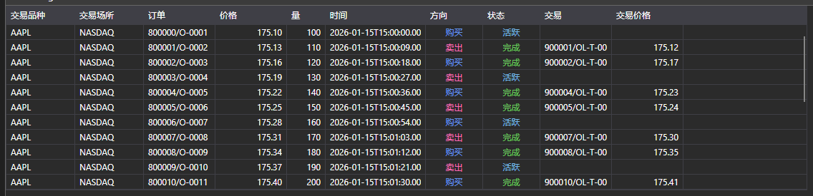

# 订单日志



[OrderLogGrid](xref:StockSharp.Xaml.OrderLogGrid) - 一个用于显示订单日志的图形组件 ([OrderLogItem](xref:StockSharp.BusinessEntities.OrderLogItem))。

**主要属性和方法**

- [OrderLogGrid.LogItems](xref:StockSharp.Xaml.OrderLogGrid.LogItems) - 订单日志项目列表。
- [OrderLogGrid.SelectedLogItem](xref:StockSharp.Xaml.OrderLogGrid.SelectedLogItem) - 选定的订单日志条目。
- [OrderLogGrid.SelectedLogItems](xref:StockSharp.Xaml.OrderLogGrid.SelectedLogItems) - 选定的订单日志条目。

以下是展示其用法的代码片段：

```xaml
<Window x:Class="SampleITCH.OrdersLogWindow"
		xmlns="http://schemas.microsoft.com/winfx/2006/xaml/presentation"
		xmlns:x="http://schemas.microsoft.com/winfx/2006/xaml"
		xmlns:loc="clr-namespace:StockSharp.Localization;assembly=StockSharp.Localization"
		xmlns:xaml="http://schemas.stocksharp.com/xaml"
		Title="{x:Static loc:LocalizedStrings.OrderLog}" Height="750" Width="900">
	<xaml:OrderLogGrid x:Name="OrderLogGrid" x:FieldModifier="public" />
</Window>
```

```cs
public class OrderLogWindow
{
	private readonly Connector _connector;
	private readonly Security _security;
	private Subscription _orderLogSubscription;
	
	public OrderLogWindow(Connector connector, Security security)
	{
		InitializeComponent();
		
		_connector = connector;
		_security = security;
		
		// 订阅订单日志项接收事件
		_connector.OrderLogItemReceived += OnOrderLogItemReceived;
		
		// 创建订单日志订阅
		_orderLogSubscription = new Subscription(DataType.OrderLog, security);
		
		// 启动订阅
		_connector.Subscribe(_orderLogSubscription);
	}
	
	// 订单日志项接收事件处理器
	private void OnOrderLogItemReceived(Subscription subscription, OrderLogItem item)
	{
		// 检查日志项是否属于我们的订阅
		if (subscription != _orderLogSubscription)
			return;
			
		// 在用户界面线程中将项目添加到 OrderLogGrid
		this.GuiAsync(() => OrderLogGrid.LogItems.Add(item));
	}
	
	// 窗口关闭时取消订阅的方法
	public void Unsubscribe()
	{
		if (_orderLogSubscription != null)
		{
			_connector.OrderLogItemReceived -= OnOrderLogItemReceived;
			_connector.UnSubscribe(_orderLogSubscription);
			_orderLogSubscription = null;
		}
	}
}
```

### 订单日志过滤

```cs
// 创建带过滤的订单日志订阅
public void SubscribeOrderLog(Security security, DateTime from, DateTime to)
{
	// 创建订单日志订阅
	var orderLogSubscription = new Subscription(DataType.OrderLog, security)
	{
		MarketData =
		{
			// 指定历史数据时间段
			From = from,
			To = to
		}
	};
	
	// 订阅订单日志项接收事件
	_connector.OrderLogItemReceived += OnFilteredOrderLogItemReceived;
	
	// 启动订阅
	_connector.Subscribe(orderLogSubscription);
}

// 带过滤的订单日志项接收事件处理器
private void OnFilteredOrderLogItemReceived(Subscription subscription, OrderLogItem item)
{
	// 检查订阅类型
	if (subscription.DataType != DataType.OrderLog)
		return;
		
	// 按价格过滤（示例）
	if (item.Price < _minPrice || item.Price > _maxPrice)
		return;
		
	// 在用户界面线程中将项目添加到 OrderLogGrid
	this.GuiAsync(() => 
	{
		OrderLogGrid.LogItems.Add(item);
		
		// 限制显示项目数量
		while (OrderLogGrid.LogItems.Count > _maxItems)
			OrderLogGrid.LogItems.RemoveAt(0);
	});
}
```

### 订单日志动态分析

```cs
	// 用于分析订单日志动态的类
public class OrderLogAnalyzer
{
	private readonly Connector _connector;
	private readonly Security _security;
	private readonly OrderLogGrid _orderLogGrid;
	
	// 用于分析的计数器
	private int _buyCount = 0;
	private int _sellCount = 0;
	private decimal _buyVolume = 0;
	private decimal _sellVolume = 0;
	
	public OrderLogAnalyzer(Connector connector, Security security, OrderLogGrid orderLogGrid)
	{
		_connector = connector;
		_security = security;
		_orderLogGrid = orderLogGrid;
		
		// 订阅订单日志项接收事件
		_connector.OrderLogItemReceived += OnOrderLogItemReceived;
		
		// 创建订单日志订阅
		var subscription = new Subscription(DataType.OrderLog, security);
		
		// 启动订阅
		_connector.Subscribe(subscription);
	}
	
	// 订单日志项接收事件处理器
	private void OnOrderLogItemReceived(Subscription subscription, OrderLogItem item)
	{
		if (item.SecurityId != _security.ToSecurityId())
			return;
			
		// 分析订单日志项
		if (item.Side == Sides.Buy)
		{
			_buyCount++;
			_buyVolume += item.Volume;
		}
		else if (item.Side == Sides.Sell)
		{
			_sellCount++;
			_sellVolume += item.Volume;
		}
		
		// 用分析结果更新界面
		this.GuiAsync(() => 
		{
			// 将项目添加到 OrderLogGrid
			_orderLogGrid.LogItems.Add(item);
			
			// 更新统计信息
			UpdateStatistics();
		});
	}
	
	// 更新统计信息
	private void UpdateStatistics()
	{
		BuyCountLabel.Content = $"买入: {_buyCount}";
		SellCountLabel.Content = $"卖出: {_sellCount}";
		BuyVolumeLabel.Content = $"买入数量: {_buyVolume}";
		SellVolumeLabel.Content = $"卖出数量: {_sellVolume}";
		
		// 计算不平衡
		var volumeImbalance = _buyVolume - _sellVolume;
		var imbalancePercent = (_buyVolume + _sellVolume) > 0 
			? volumeImbalance / (_buyVolume + _sellVolume) * 100 
			: 0;
			
		ImbalanceLabel.Content = $"不平衡: {volumeImbalance:F2} ({imbalancePercent:F2}%)";
	}
}
```
