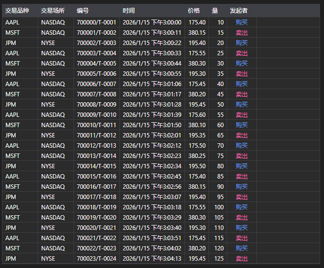

# 逐笔成交



[TradeGrid](xref:StockSharp.Xaml.TradeGrid) - 一个交易表。

**主要属性**

- [TradeGrid.Trades](xref:StockSharp.Xaml.TradeGrid.Trades) - 交易列表。
- [TradeGrid.SelectedTrade](xref:StockSharp.Xaml.TradeGrid.SelectedTrade) - 已选择的交易。
- [TradeGrid.SelectedTrades](xref:StockSharp.Xaml.TradeGrid.SelectedTrades) - 已选择的交易。

以下是展示其用法的代码片段：

```xaml
<Window x:Class="Sample.TradesWindow"
	xmlns="http://schemas.microsoft.com/winfx/2006/xaml/presentation"
	xmlns:x="http://schemas.microsoft.com/winfx/2006/xaml"
	xmlns:loc="clr-namespace:StockSharp.Localization;assembly=StockSharp.Localization"
	xmlns:xaml="http://schemas.stocksharp.com/xaml"
	Title="{x:Static loc:LocalizedStrings.Str985}" Height="284" Width="544">
	<xaml:TradeGrid x:Name="TradeGrid" x:FieldModifier="public" />
</Window>
```

```cs
public class TradesWindow
{
	private readonly Connector _connector;
	private readonly Security _security;
	private Subscription _tickSubscription;
	
	public TradesWindow(Connector connector, Security security)
	{
		InitializeComponent();
		
		_connector = connector;
		_security = security;
		
		// 订阅 tick 成交接收事件
		_connector.TickTradeReceived += OnTickReceived;
		
		// 创建 tick 成交订阅
		_tickSubscription = new Subscription(DataType.Ticks, security);
		
		// 启动订阅
		_connector.Subscribe(_tickSubscription);
	}
	
	// tick 成交接收事件处理器
	private void OnTickReceived(Subscription subscription, ITickTradeMessage tick)
	{
		// 检查成交是否属于我们的订阅
		if (subscription != _tickSubscription)
			return;
			
		// 在用户界面线程中将成交添加到 TradeGrid
		this.GuiAsync(() => TradeGrid.Trades.Add(tick));
	}
	
	// 窗口关闭时取消订阅的方法
	public void Unsubscribe()
	{
		if (_tickSubscription != null)
		{
			_connector.TickTradeReceived -= OnTickReceived;
			_connector.UnSubscribe(_tickSubscription);
			_tickSubscription = null;
		}
	}
}
```

### 显示自己的交易

```cs
public class MyTradesWindow
{
	private readonly Connector _connector;
	
	public MyTradesWindow(Connector connector)
	{
		InitializeComponent();
		
		_connector = connector;
		
		// 订阅自有成交接收事件
		_connector.OwnTradeReceived += OnOwnTradeReceived;
		
		// 创建交易数据订阅
		var myTradesSubscription = new Subscription(DataType.Transactions, null);
		
		// 启动订阅
		_connector.Subscribe(myTradesSubscription);
	}
	
	// 自有成交接收事件处理器
	private void OnOwnTradeReceived(Subscription subscription, MyTrade myTrade)
	{
		// 在用户界面线程中将自有成交添加到 TradeGrid
		this.GuiAsync(() => TradeGrid.Trades.Add(myTrade));
	}
}
```

### 获取历史成交数据

```cs
// 获取历史 tick 成交的方法
public void LoadHistoricalTicks(Security security, DateTime from, DateTime to)
{
	// 清除当前成交
	TradeGrid.Trades.Clear();
	
	// 创建历史 tick 成交订阅
	var historySubscription = new Subscription(DataType.Ticks, security)
	{
		MarketData =
		{
			// 指定历史数据时间段
			From = from,
			To = to
		}
	};
	
	// 订阅 tick 成交接收事件
	_connector.TickTradeReceived += OnHistoricalTickReceived;
	
	// 启动订阅
	_connector.Subscribe(historySubscription);
}

// 历史 tick 成交接收事件处理器
private void OnHistoricalTickReceived(Subscription subscription, ITickTradeMessage tick)
{
	// 在用户界面线程中将 tick 添加到 TradeGrid
	this.GuiAsync(() => 
	{
		TradeGrid.Trades.Add(tick);
		
		// 更新统计信息
		UpdateTradeStatistics();
	});
}

// 更新成交统计的方法
private void UpdateTradeStatistics()
{
	int totalTrades = TradeGrid.Trades.Count;
	decimal totalVolume = TradeGrid.Trades.Sum(t => t.Volume);
	decimal averagePrice = TradeGrid.Trades.Any() 
		? TradeGrid.Trades.Average(t => t.Price)
		: 0;
	
	// 更新界面统计元素
	TotalTradesLabel.Content = $"成交总数: {totalTrades}";
	TotalVolumeLabel.Content = $"总成交量: {totalVolume}";
	AveragePriceLabel.Content = $"平均价格: {averagePrice:F2}";
}
```

### 按成交量筛选交易

```cs
// 按最小成交量过滤成交的方法
public void FilterTicksByVolume(decimal minVolume)
{
	// 保存过滤值
	_minVolumeFilter = minVolume;
	
	// 更新 tick 成交接收事件处理器
	_connector.TickTradeReceived -= OnTickReceived;
	_connector.TickTradeReceived += OnFilteredTickReceived;
}

// 带成交量过滤的 tick 成交接收事件处理器
private void OnFilteredTickReceived(Subscription subscription, ITickTradeMessage tick)
{
	// 检查成交是否属于所选交易品种
	if (tick.SecurityId != _security.ToSecurityId())
		return;
		
	// 应用成交量过滤
	if (tick.Volume < _minVolumeFilter)
		return;
		
	// 在用户界面线程中将成交添加到 TradeGrid
	this.GuiAsync(() => TradeGrid.Trades.Add(tick));
	
	// 如果是大额成交，可以高亮显示或发送通知
	if (tick.Volume >= _largeVolumeThreshold)
	{
		NotifyLargeVolumeTrade(tick);
	}
}

// 大额成交通知的方法
private void NotifyLargeVolumeTrade(ITickTradeMessage tick)
{
	// 输出大额成交信息
	Console.WriteLine($"大额交易: {tick.SecurityId}, {tick.ServerTime}, 价格: {tick.Price}, 成交量: {tick.Volume}");
	
	// 可以添加声音或视觉通知
	this.GuiAsync(() => 
	{
		// 列表中视觉高亮的示例
		var tradeItem = TradeGrid.Trades.LastOrDefault();
		if (tradeItem != null)
		{
			TradeGrid.SelectedTrade = tradeItem;
			HighlightTrade(tradeItem);
		}
	});
}
```
