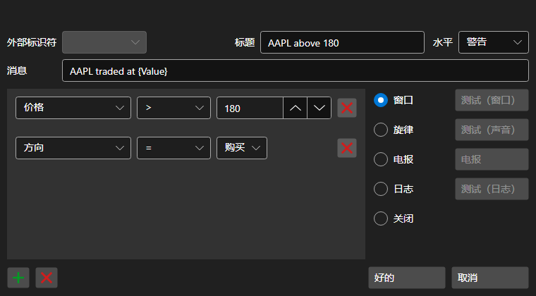

# 通知设置窗口

[AlertSettingsWindow](xref:StockSharp.Alerts.AlertSettingsWindow) - 配置特定事件通知的窗口

您可以配置有关以下数据类型变更的通知：投资组合、客户代码、经纪商、托管机构、服务器时间、交易、数据类型、取消、订单ID、订单ID（字符串）、订单ID（平台）、衍生品、衍生品（字符串）、价格、成交量（订单）、成交量（交易）、可见成交量、方向、余额、订单类型、状态、备注、订单信息、系统订单、订单到期时间、执行条件、价格、交易发起者、未平仓合约、错误、条件、上升趋势、佣金、延迟、滑点、标识符（用户）、货币、盈亏、持仓、做市商。

通知可以采取以下形式：

- **窗口** - 屏幕角落会出现一个带有信息的小弹出窗口。
- **旋律** - 旋律将会演奏。
- **短信** - 信息将通过短信发送。
- **电子邮件** - 消息将通过电子邮件发送。
- **语音** - 信息将由电脑生成的语音朗读。
- **日志** - 消息将发送到 Designer 日志窗口。
- **已禁用** - 不会显示通知。
