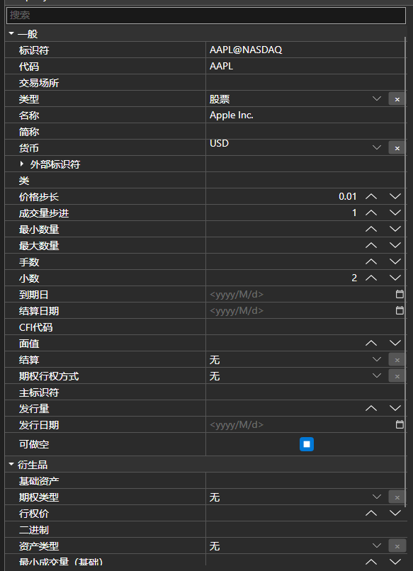

# 对象属性编辑表

[PropertyGridEx](xref:StockSharp.Xaml.PropertyGrid.PropertyGridEx) - 用于编辑对象属性的表格。该组件包括一组用于系统类型和[S#](../../api.md)类型的附加编辑器。



[PropertyGridEx](xref:StockSharp.Xaml.PropertyGrid.PropertyGridEx) 为以下类型提供了自己的编辑器：

- [单位](xref:StockSharp.Messages.Unit)。
- [安全](xref:StockSharp.BusinessEntities.Security)。
- [投资组合](xref:StockSharp.BusinessEntities.Portfolio). 
- [交易板](xref:StockSharp.BusinessEntities.ExchangeBoard)。
- [交易](xref:StockSharp.BusinessEntities.Exchange)。
- **ExtensionInfo** 目录。
- [System.TimeSpan](xref:System.TimeSpan)、[System.DateTime](xref:System.DateTime) 和 [System.DateTimeOffset](xref:System.DateTimeOffset)。
- [System.Net.EndPoint](xref:System.Net.EndPoint) 和 [System.Net.IPAddress](xref:System.Net.IPAddress)。
- [System.Security.SecureString](xref:System.Security.SecureString)。 
- [System.Text.Encoding](xref:System.Text.Encoding)。 
- [System.Enum](xref:System.Enum)。 

**主要属性**

- [PropertyGridEx.SecurityProvider](xref:StockSharp.Xaml.PropertyGrid.PropertyGridEx.SecurityProvider) - 关于交易品种信息的提供者。
- [PropertyGridEx.ExchangeInfoProvider](xref:StockSharp.Xaml.PropertyGrid.PropertyGridEx.ExchangeInfoProvider) - 网站信息提供者。
- [PropertyGridEx.Portfolios](xref:StockSharp.Xaml.PropertyGrid.PropertyGridEx.Portfolios) - 可用投资组合的列表。
- **SelectedObject** - 将在表格中显示其属性的对象。

下面是带有使用示例的代码片段。代码示例取自 *Samples/Fix/SampleFix*。

```xaml
<Window x:Class="SampleFix.MainWindow"
		xmlns="http://schemas.microsoft.com/winfx/2006/xaml/presentation"
		xmlns:x="http://schemas.microsoft.com/winfx/2006/xaml"
		xmlns:loc="clr-namespace:StockSharp.Localization;assembly=StockSharp.Localization"
		xmlns:propertyGrid="http://schemas.stocksharp.com/xaml"
		Title="{x:Static loc:LocalizedStrings.XamlStr540}" Height="110" Width="512">
	<Grid>
		<Grid.ColumnDefinitions>
			<ColumnDefinition />
			<ColumnDefinition />
			<ColumnDefinition />
			<ColumnDefinition />
			<ColumnDefinition />
		</Grid.ColumnDefinitions>
		<Grid.RowDefinitions>
			<RowDefinition Height="24" />
			<RowDefinition Height="Auto" />
			<RowDefinition Height="Auto" />
		</Grid.RowDefinitions>
		<StackPanel Grid.Column="0" Grid.Row="0" Grid.ColumnSpan="5" Orientation="Horizontal">
			<xctk:DropDownButton Content="{x:Static loc:LocalizedStrings.TransactionalSession}">
				<xctk:DropDownButton.DropDownContent>
					<propertyGrid:PropertyGridEx x:Name="TransactionSessionSettings" />
				</xctk:DropDownButton.DropDownContent>
			</xctk:DropDownButton>
			<xctk:DropDownButton Content="{x:Static loc:LocalizedStrings.MarketDataSession}">
				<xctk:DropDownButton.DropDownContent>
					<propertyGrid:PropertyGridEx x:Name="MarketDataSessionSettings" />
				</xctk:DropDownButton.DropDownContent>
			</xctk:DropDownButton>
		</StackPanel>
		
		<Button x:Name="ConnectBtn" Background="LightPink" Grid.Column="0" Grid.Row="1" Grid.RowSpan="2" Content="{x:Static loc:LocalizedStrings.Connect}" Click="ConnectClick" />
		<Button x:Name="ShowSecurities" Grid.Column="1" Grid.Row="1" IsEnabled="False" Content="{x:Static loc:LocalizedStrings.Securities}" Click="ShowSecuritiesClick" />
		<Button x:Name="ShowPortfolios" Grid.Column="2" Grid.Row="1" IsEnabled="False" Content="{x:Static loc:LocalizedStrings.Portfolios}" Click="ShowPortfoliosClick" />
		<Button x:Name="ShowStopOrders" Grid.Column="3" Grid.Row="1" IsEnabled="False" Content="{x:Static loc:LocalizedStrings.StopOrders}" Click="ShowStopOrdersClick" />
		<Button x:Name="ShowNews" Grid.Column="4" Grid.Row="1" IsEnabled="False" Content="{x:Static loc:LocalizedStrings.News}" Click="ShowNewsClick" />
		
		<Button x:Name="ShowTrades" Grid.Column="1" Grid.Row="2" IsEnabled="False" Content="{x:Static loc:LocalizedStrings.Ticks}" Click="ShowTradesClick" />
		<Button x:Name="ShowMyTrades" Grid.Column="2" Grid.Row="2" IsEnabled="False" Content="{x:Static loc:LocalizedStrings.MyTrades}" Click="ShowMyTradesClick" />
		<Button x:Name="ShowOrders" Grid.Column="3" Grid.Row="2" IsEnabled="False" Content="{x:Static loc:LocalizedStrings.Orders}" Click="ShowOrdersClick" />
	</Grid>
</Window>
	  				
```
```cs
private readonly Connector _connector = new Connector();
public MainWindow()
{
	InitializeComponent();
	Title = Title.Put("FIX");
	_ordersWindow.MakeHideable();
	_myTradesWindow.MakeHideable();
	_tradesWindow.MakeHideable();
	_securitiesWindow.MakeHideable();
	_stopOrdersWindow.MakeHideable();
	_portfoliosWindow.MakeHideable();
	_newsWindow.MakeHideable();
	if (File.Exists(_settingsFile))
	{
		_connector_connector.Load(new JsonSerializer<SettingsStorage>().Deserialize(_settingsFile));
	}
	MarketDataSessionSettings.SelectedObject = ((ChannelMessageAdapter)_connector.MarketDataAdapter).InnerAdapter;
	TransactionSessionSettings.SelectedObject = ((ChannelMessageAdapter)_connector.TransactionAdapter).InnerAdapter;
	Instance = this;
	_connector.LogLevel = LogLevels.Debug;
	_logManager.Sources.Add(_connector);
	_logManager.Listeners.Add(new FileLogListener { LogDirectory = "StockSharp_Fix" });
}
	  				
```
