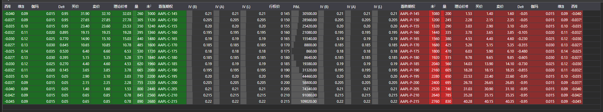

# 期权交易台

[OptionDesk](xref:StockSharp.Xaml.OptionDesk) 图形组件是用于显示期权报价的表格。它显示“希腊字母”、隐含波动率、理论价格、认购和认沽期权的最佳买卖报价。

下面是 **OptionCalculator** 示例，该示例使用了此组件。示例的源代码可以在 *Samples/06_Strategies/09_LiveOptionsQuoting* 文件夹中找到。



## 期权计算器示例

1. 在 XAML 代码中，添加 [OptionDesk](xref:StockSharp.Xaml.OptionDesk) 元素并为其分配 **Desk** 名称。

   ```xaml
   <Window x:Class="OptionCalculator.MainWindow"
           xmlns="http://schemas.microsoft.com/winfx/2006/xaml/presentation"
           xmlns:x="http://schemas.microsoft.com/winfx/2006/xaml"
           xmlns:loc="clr-namespace:StockSharp.Localization;assembly=StockSharp.Localization"
           xmlns:xaml="http://schemas.stocksharp.com/xaml"
           Title="{x:Static loc:LocalizedStrings.XamlStr396}" Height="400" Width="1030">
       <Grid Margin="5,5,5,5">
       
   	    .........................................................
   	    
   	    <xaml:OptionDesk x:Name="Desk" Grid.Row="6" Grid.ColumnSpan="3" Grid.Column="0" />
       
   	</Grid>
   </Window>
   	  				
   ```
2. 在 C# 代码中，创建一个连接并订阅必要的事件。

   ```cs
   ...                 
   public readonly Connector Connector = new Connector();
   ...                 
   // 订阅连接成功事件
   Connector.Connected += () =>
   {
   	// 更新界面标签
   	this.GuiAsync(() => ChangeConnectStatus(true));
   };
   // 订阅断开连接事件
   Connector.Disconnected += () =>
   {
   	// 更新界面标签
   	this.GuiAsync(() => ChangeConnectStatus(false));
   };
   // 订阅连接错误事件
   Connector.ConnectionError += error => this.GuiAsync(() =>
   {
   	// 更新界面标签
   	ChangeConnectStatus(false);
   	MessageBox.Show(this, error.ToString(), LocalizedStrings.ErrorConnection);
   });
   // 填充标的资产列表
   Connector.SecurityReceived += (sub, security) =>
   {
   	if (security.Type == SecurityTypes.Future)
   		_assets.Add(security);
   };
   Connector.Level1Received += (sub, security) =>
   {
   	if (_model.UnderlyingAsset == security || _model.UnderlyingAsset.Id == security.UnderlyingSecurityId)
   		_isDirty = true;
   };
   // 订阅 tick 价格并更新资产价格
   Connector.TickTradeReceived += (sub, trade) =>
   {
   	if (_model.UnderlyingAsset == trade.Security || _model.UnderlyingAsset.Id == trade.Security.UnderlyingSecurityId)
   		_isDirty = true;
   };
   Connector.NewPosition += position => this.GuiAsync(() =>
   {
   	var asset = SelectedAsset;
   	if (asset == null)
   		return;
   	var assetPos = position.Security == asset;
   	var newPos = position.Security.UnderlyingSecurityId == asset.Id;
   	if (!assetPos && !newPos)
   		return;
   	if (assetPos)
   		PosChart.AssetPosition = position;
   	if (newPos)
   		PosChart.Positions.Add(position);
   	RefreshChart();
   });
   Connector.PositionChanged += position => this.GuiAsync(() =>
   {
   	if ((PosChart.AssetPosition != null && PosChart.AssetPosition == position) || PosChart.Positions.Cache.Contains(position))
   		RefreshChart();
   });
   try
   {
   	if (File.Exists(_settingsFile))
   		Connector.Load(new JsonSerializer<SettingsStorage>().Deserialize(_settingsFile));
   }
   ...
   ```
3. 连接时，为市场数据设置消息提供者。

   ```cs
   private void ConnectClick(object sender, RoutedEventArgs e)
   {
   	if (!_isConnected)
   	{
   		ConnectBtn.IsEnabled = false;
   		_model.Clear();
   		_model.MarketDataProvider = Connector;
   ...
   		Connector.Connect();
   	}
   	else
   		Connector.Disconnect();
   }
   ```
4. 在接收工具时，我们将基础资产添加到清单中。

   ```cs
   // 填充标的资产列表
   Connector.SecurityReceived += (sub, security) =>
   {
   	if (security.Type == SecurityTypes.Future)
   		_assets.Add(security);
   };
   ```
5. 选择乐器时：
   - 用一连串选项填充数组，其中所选的工具作为基础资产；
   - 将此数组分配给 [OptionDeskModel.Options](xref:StockSharp.Xaml.OptionDeskModel.Options) 属性；
   - 使用 [OptionDeskModel.Clear](xref:StockSharp.Xaml.OptionDeskModel.Clear) 方法清除选项板的值。
   ```cs
   private void Assets_OnSelectionChanged(object sender, SelectionChangedEventArgs e)
   {
   	var asset = SelectedAsset;
   	_model.UnderlyingAsset = asset;
   	_model.Clear();
   	_options.Clear();
   	var options = asset.GetDerivatives(Connector);
   	foreach (var security in options)
   	{
   		_model.Add(security);
   		_options.Add(security);
   	}
   	ProcessPositions();
   }
   ```

## 推荐内容

[希腊人](../../options/greeks.md)
