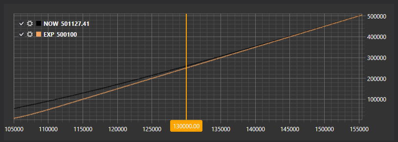

# 职位图表

[OptionPositionChart](xref:StockSharp.Xaml.Charting.OptionPositionChart) 图形组件是一个显示与标的资产相关的仓位及期权“希腊值”的图表。

以下是 SampleOptionQuoting 示例，其中使用了该图表。示例的源代码可以在 *Samples/06_Strategies/09_LiveOptionsQuoting* 文件夹中找到。



## SampleOptionQuoting 示例

1. 在 XAML 代码中，添加 [OptionPositionChart](xref:StockSharp.Xaml.Charting.OptionPositionChart) 元素，并将其命名为 **PosChart**。

   ```xaml
   <Window x:Class="OptionCalculator.MainWindow"
           xmlns="http://schemas.microsoft.com/winfx/2006/xaml/presentation"
           xmlns:x="http://schemas.microsoft.com/winfx/2006/xaml"
           xmlns:loc="clr-namespace:StockSharp.Localization;assembly=StockSharp.Localization"
           xmlns:xaml="http://schemas.stocksharp.com/xaml"
           Title="{x:Static loc:LocalizedStrings.XamlStr396}" Height="400" Width="1030">
       <Grid Margin="5,5,5,5">
       
   	    .........................................................
   	    
   	    <xaml:OptionPositionChart x:Name="PosChart" Grid.Row="7" Grid.Column="0" Grid.ColumnSpan="6" />
   	</Grid>
   </Window>
   				
   ```

2. 在 C# 代码中，创建一个连接并订阅必要的事件。

   ```cs
   ...                 
   public readonly Connector Connector = new Connector();
   ...                 
   // subscribe on connection successfully event
   Connector.Connected += () =>
   {
   	// update gui labels
   	this.GuiAsync(() => ChangeConnectStatus(true));
   };
   // subscribe on disconnection event
   Connector.Disconnected += () =>
   {
   	// update gui labels
   	this.GuiAsync(() => ChangeConnectStatus(false));
   };
   // subscribe on connection error event
   Connector.ConnectionError += error => this.GuiAsync(() =>
   {
   	// update gui labels
   	ChangeConnectStatus(false);
   	MessageBox.Show(this, error.ToString(), LocalizedStrings.ErrorConnection);
   });
   // fill underlying asset's list
   Connector.SecurityReceived += (sub, security) =>
   {
   	if (security.Type == SecurityTypes.Future)
   		_assets.Add(security);
   };
   Connector.Level1Received += (sub, security) =>
   {
   	if (_model.UnderlyingAsset == security || _model.UnderlyingAsset.Id == security.UnderlyingSecurityId)
   		_isDirty = true;
   };
   // subscribing on tick prices and updating asset price
   Connector.TickTradeReceived += (sub, trade) =>
   {
   	if (_model.UnderlyingAsset == trade.Security || _model.UnderlyingAsset.Id == trade.Security.UnderlyingSecurityId)
   		_isDirty = true;
   };
   Connector.NewPosition += position => this.GuiAsync(() =>
   {
   	var asset = SelectedAsset;
   	if (asset == null)
   		return;
   	var assetPos = position.Security == asset;
   	var newPos = position.Security.UnderlyingSecurityId == asset.Id;
   	if (!assetPos && !newPos)
   		return;
   	RefreshChart();
   });
   Connector.PositionChanged += position => this.GuiAsync(() =>
   {
   	if ((PosChart.AssetPosition != null && PosChart.AssetPosition == position) || PosChart.Positions.Cache.Contains(position))
   		RefreshChart();
   });
   try
   {
   	if (File.Exists(_settingsFile))
   		Connector.Load(new JsonSerializer<SettingsStorage>().Deserialize(_settingsFile));
   }
   ...
   ```

3. 连接时，设置初始控制设置：

   1. 正在重置 [OptionPositionChart.Model](xref:StockSharp.Xaml.Charting.OptionPositionChart.Model) 控件的模型；
   2. 使用初始值重新绘制图表 [OptionPositionChart.Refresh](xref:StockSharp.Xaml.Charting.OptionPositionChart.Refresh(System.Nullable{System.Decimal},System.Nullable{System.DateTimeOffset},System.Nullable{System.DateTimeOffset}))**(**[System.Nullable\<System.Decimal\>](xref:System.Nullable`1) assetPrice, [System.Nullable\<System.DateTimeOffset\>](xref:System.Nullable`1) currentTime, [System.Nullable\<System.DateTimeOffset\>](xref:System.Nullable`1) expiryDate **)**;
   3. 为市场数据和工具指定消息提供者。

   ```cs
   private void ConnectClick(object sender, RoutedEventArgs e)
   {
   	if (!_isConnected)
   	{
   		ConnectBtn.IsEnabled = false;
   ...
   		PosChart.Model = null;
   ...
   		PosChart.MarketDataProvider = Connector;
   		PosChart.SecurityProvider = Connector;
   		PosChart.PositionProvider = Connector;
   		Connector.Connect();
   	}
   	else
   		Connector.Disconnect();
   }
   ```

4. 在接收工具时，我们将基础资产添加到清单中。

   ```cs
   Connector.SecurityReceived += (sub, security) =>
   {
   	if (security.Type == SecurityTypes.Future)
   		_assets.Add(security);
   };
   ```

5. 在更改基础工具或期权的 Level1，或者获得新的交易时，我们会设置 _isDirty 标志。这允许在定时器事件中调用 RefreshChart 方法（见下文）（代码省略）来重新绘制图表。这样我们就可以控制重绘的频率。

   ```cs
   Connector.Level1Received += (sub, security) =>
   {
   	if (_model.UnderlyingAsset == security || _model.UnderlyingAsset.Id == security.UnderlyingSecurityId)
   		_isDirty = true;
   };
   Connector.TickTradeReceived += (sub, trade) =>
   {
   	if (_model.UnderlyingAsset == trade.Security || _model.UnderlyingAsset.Id == trade.Security.UnderlyingSecurityId)
   		_isDirty = true;
   };
   ```

6. 在新位置发生事件处理程序中，我们调用`RefreshChart`来重绘图表。

   ```cs
   Connector.NewPosition += position => this.GuiAsync(() =>
   {
   	var asset = SelectedAsset;
   	if (asset == null)
   		return;
   	var assetPos = position.Security == asset;
   	var newPos = position.Security.UnderlyingSecurityId == asset.Id;
   	if (!assetPos && !newPos)
   		return;
   	RefreshChart();
   });
   Connector.PositionChanged += position => this.GuiAsync(() =>
   {
   	if ((PosChart.AssetPosition != null && PosChart.AssetPosition == position) || PosChart.Positions.Cache.Contains(position))
   		RefreshChart();
   });
   ```

7. 此方法会重绘图表：

   ```cs
   private void RefreshChart()
   {
   	var asset = SelectedAsset;
   	var trade = asset.LastTrade;
   	if (trade != null)
   		PosChart.Refresh(trade.Price);
   }
   ```

## 推荐内容

[波动性交易](../../options/volatility_trading.md)
