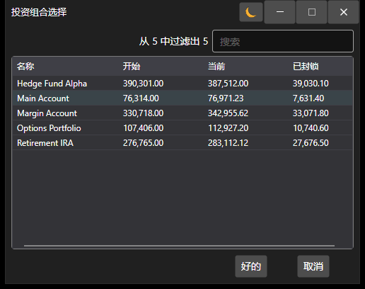

# 投资组合选择窗口

[PortfolioPickerWindow](xref:StockSharp.Xaml.PortfolioPickerWindow) 是一个用于选择投资组合的窗口。该窗口显示投资组合列表及投资组合现金持仓的信息。



**主要属性**

- [PortfolioPickerWindow.Portfolios](xref:StockSharp.Xaml.PortfolioPickerWindow.Portfolios) - 投资组合列表。
- [PortfolioPickerWindow.SelectedPortfolio](xref:StockSharp.Xaml.PortfolioPickerWindow.SelectedPortfolio) - 所选的投资组合。

下面是含有使用示例的代码片段。

```cs
private void Button_Click(object sender, RoutedEventArgs e)
{
	var wnd = new PortfolioPickerWindow();
	if (Portfolios != null)
		wnd.Portfolios = Portfolios;
	if (wnd.ShowModal(this))
	{
		SelectedPortfolio = wnd.SelectedPortfolio;
	}
}
	  				
```
