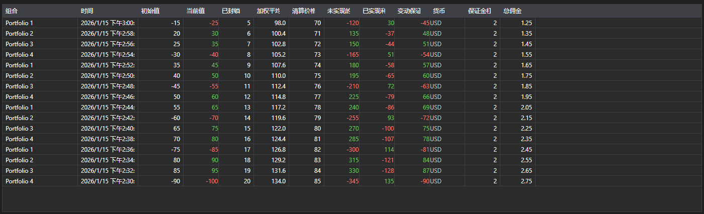

# 持仓变化



[PositionChangeGrid](xref:StockSharp.Xaml.PositionChangeGrid) - [PositionChangeMessage](xref:StockSharp.Messages.PositionChangeMessage) 消息的表格。与投资组合表格不同，它显示的不是当前状态而是变化流：每一行都是一条包含已变更值集合的消息。

**主要属性**

- [PositionChangeGrid.Messages](xref:StockSharp.Xaml.PositionChangeGrid.Messages) - 持仓变化消息列表。
- [PositionChangeGrid.SelectedMessage](xref:StockSharp.Xaml.PositionChangeGrid.SelectedMessage) - 选中的消息。
- [PositionChangeGrid.SelectedMessages](xref:StockSharp.Xaml.PositionChangeGrid.SelectedMessages) - 选中的多条消息。
- [PositionChangeGrid.MaxCount](xref:StockSharp.Xaml.PositionChangeGrid.MaxCount) - 表格的最大行数，超出后会删除最早的行。

这种变化流便于排查差异：可以看到连接器在什么时候发送了哪个值，而不仅仅是最终结果。

下面是其使用的代码片段:

```xaml
<Window x:Class="Sample.PositionChangesWindow"
	xmlns="http://schemas.microsoft.com/winfx/2006/xaml/presentation"
	xmlns:x="http://schemas.microsoft.com/winfx/2006/xaml"
	xmlns:xaml="http://schemas.stocksharp.com/xaml"
	Height="400" Width="900">
	<xaml:PositionChangeGrid x:Name="PositionChangeGrid" />
</Window>
```

```cs
// 从连接器接收持仓变化
_connector.PositionReceived += (subscription, position) =>
{
	var message = position.ToChangeMessage();

	// 在界面线程中把消息添加到表格
	this.GuiAsync(() => PositionChangeGrid.Messages.Add(message));
};

// 创建持仓变化订阅
_connector.Subscribe(new Subscription(DataType.PositionChanges));
```

## 另请参阅

[投资组合](../portfolios.md)
